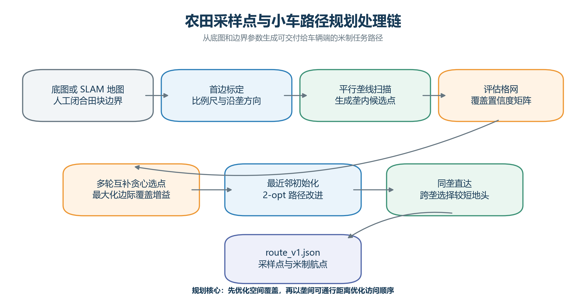
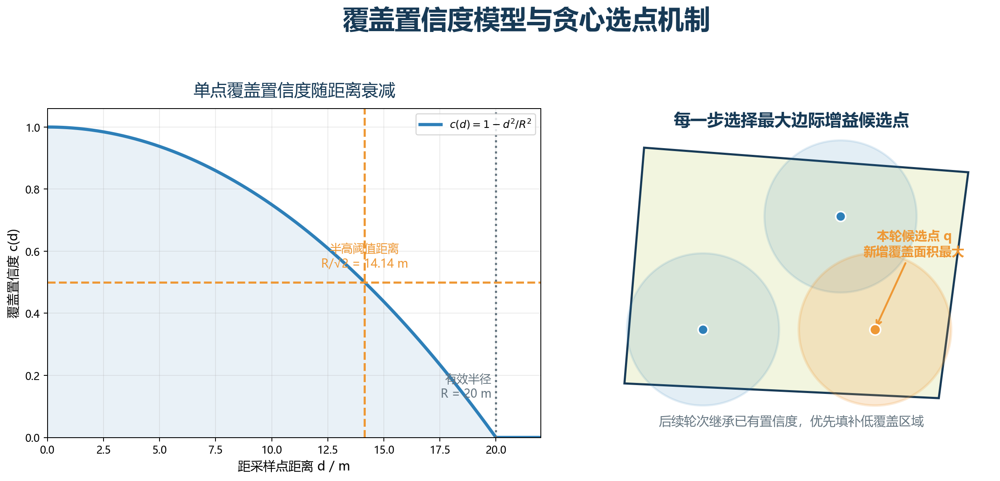
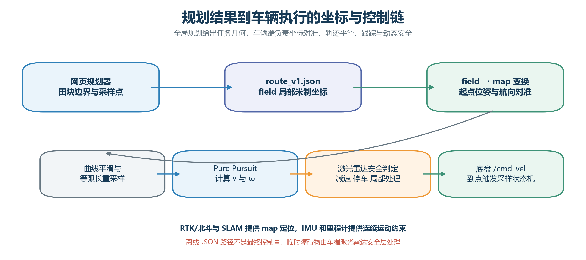

# R-02_小车路径规划与采样点规划章节_完整版.docx
- 段落数：80
- 表格数：4
- 图片数：4

小车路径规划与采样点规划技术研究

章节主题：覆盖算法推导、采样策略与车辆可执行路径

任务编号：R-02

适用项目：DG-202605 基于机器人与 DNA-PCR 技术的孢子病害识别关键技术研究

# 1 任务定位与技术目标

本章节面向孢子病害巡检任务中的“小车路径规划与采样点规划”环节，目标是把田块底图、人工标定边界和采样参数转化为具有明确坐标语义、采样顺序及米制航点的任务文件，并为车辆端的定位、轨迹跟踪和局部避障提供稳定接口。该环节位于图像/地图输入与机器人执行之间，既要保证有限采样点对田块的空间覆盖能力，又要降低跨垄次数和无效行驶距离。

结合项目仓库现有实现，规划器当前采用“平行垄线候选点生成—覆盖置信度贪心选点—地头通行距离排序—最近邻与 2-opt 改进”的分层方法。底图用于显示和边界标定，田块轮廓由操作者闭合点选；现阶段并未直接从原始农田图片中自动识别作物、障碍物或可通行区域。该边界应在报告与验收时明确，以避免把车辆端激光雷达的动态避障能力误写为离线路径规划器的图像识别能力。

图 1  农田采样点与小车路径规划处理链

# 2 规划输入与坐标定义

## 2.1 输入参数与边界标定

规划器的基础输入包括田块图片或 SLAM 地图、闭合田块边界、首边实际长度、垄间距、每轮采样点数、孢子影响半径、采样轮数以及规划速度。操作者按顺序点选田块边界，首个点 p₀ 作为局部坐标原点，p₀ 到 p₁ 的第一条边界同时用于比例尺标定和沿垄方向定义。若第一条边界与真实垄向不一致，应在标定阶段重新选择点序，而不能在车辆端临时修正。

表 1  路径规划主要输入参数

| 输入项 | 符号/字段 | 单位 | 工程作用 |
| 闭合田块边界 | field_polygon | 像素/米 | 限制候选点与覆盖评估区域 |
| 首边实际长度 | L_ref | m | 由首边像素长度计算比例尺 |
| 垄间距 | ridge_spacing | m | 生成平行垄线扫描间隔 |
| 每轮采样点数 | samples_per_round | 个 | 控制单轮采样规模 |
| 孢子影响半径 | R | m | 定义覆盖置信度衰减范围 |
| 采样轮数 | rounds | 轮 | 执行多轮互补覆盖 |
| 规划速度 | v_plan | m/s | 估算任务时间，不直接替代底盘限速 |

## 2.2 像素坐标到田块局部坐标

设首边像素端点为 p₀=(u₀,v₀)、p₁=(u₁,v₁)，首边实测长度为 L_ref。像素比例尺 s 与首边航向角 α 分别由下式得到。图像纵轴通常向下，因此旋转后还需依据闭合多边形的内部所在侧确定 +y 方向，使 +x 沿垄、+y 跨垄并指向田块内部。

当前 route_v1 导出器采用 field 局部米制坐标：原点为第一边界点，+x 为第一条边界方向，+y 为田块内部方向。历史 test-3 文件中的 relative_m 仍保留图像相对方向，不应直接当作 ROS map 坐标使用；进入树莓派前应通过刚体旋转和平移转换为 field 坐标，或直接使用新版 route_v1.json。

## 2.3 field、ENU 与 ROS map 对准

若车辆使用 RTK/北斗，应实测田块原点的经纬度，并至少提供首边方向的第二个地理控制点或可靠航向角。GNSS 经纬度先转换为局部 ENU（东、北、天）坐标，再按首边航向旋转到 field 坐标；车辆执行时由静态变换或任务起点配准建立 field→map。map→odom 由定位系统持续校正，odom→base_link 由轮速里程计和 IMU 提供连续短时运动。

其中 ψ₀ 为 field 的 +x 轴在 map 坐标系中的航向，t₀ 为田块原点在 map 中的位置。只有原点经纬度而没有首边方向，无法唯一确定局部坐标系旋转角；因此部署资料至少应包含原点、首边方向、坐标单位、轴向约定和时间戳。

# 3 采样点规划方法

## 3.1 平行垄线扫描与候选点生成

将闭合多边形旋转到首边水平的内部坐标后，规划器按垄间距生成一组平行扫描线，并计算每条扫描线与田块多边形的交段。候选点只布置在有效交段内，再按与田块尺度相适应的步长均匀采样。由此获得与真实田块轮廓一致的离散候选集合，后续优化无需在多边形外进行无效搜索。

仓库旧版程序对候选点间隔设置了不小于约 1.5 m 的下限，并根据边界尺度自适应调整；覆盖评估使用更稀疏的格网以控制计算量。该设计适合比赛阶段的快速交互，但格网分辨率会影响覆盖率数值，因此报告中所有对比应固定同一评估网格、边界和阈值。

## 3.2 覆盖置信度模型

对候选采样点 q 与田块评估格点 g，令 d(q,g) 为欧氏距离，R 为设定的孢子影响半径。单点覆盖置信度采用半径内二次衰减、半径外为零的模型：

已选点集合 S 对格点 g 的置信度取各采样点贡献的最大值，而不是简单相加，从而避免重叠区域重复计数。程序统计 coverage_pct 时采用 C_S(g)>0.5 的半高阈值；其对应几何距离为 R/√2。完整影响半径 d<R 的几何覆盖率与半高阈值覆盖率含义不同，二者必须分别报告。

图 2  覆盖置信度模型与最大边际增益选点机制

## 3.3 多轮互补贪心选点

每一步计算加入候选点 q 后对全部评估格点带来的正向置信度增量，并选取边际增益最大的候选点。完成一轮后，不清空已有置信度矩阵，而是将上一轮覆盖结果传递给下一轮，使后续采样点优先填补低置信度区域，实现轮次之间的空间互补。

该实现的选点目标是覆盖增益，现有代码并未在贪心评分中加入路径距离惩罚项。行驶距离的优化在采样点确定后独立完成。将“覆盖优化”和“访问顺序优化”分层，可减少参数耦合并便于解释；若后续需要同时权衡覆盖率和能耗，应通过对比试验再引入统一目标函数。

# 4 巡检顺序与车辆可执行航点

## 4.1 垄间通行距离模型

采样点位于同一垄间通道时，车辆采用通道内直达；采样点位于不同通道时，规划器分别计算经左地头和右地头的行驶距离，选择较短地头完成跨垄。该距离不是采样点间的直线欧氏距离，而是遵守“通道内纵向移动—地头横向换垄—目标通道纵向移动”的可通行路径长度。

由两个采样点生成的每条 segment 均保存 travel_waypoints_m 航点序列。travel_waypoints_m 不是独立文件名，而是 JSON 路径段中的字段；它描述该段从起点、经必要地头拐点到终点的米制折线，是车辆端平滑与跟踪的几何输入。

## 4.2 最近邻初始化与 2-opt 改进

对每轮采样点，算法先用垄间通行距离构造最近邻闭合巡回，快速获得可行访问顺序；随后使用 2-opt 交换两条边，若交换后总路径更短则保留改进，直至本轮没有可接受交换。该方法计算开销低、结果可解释，适合比赛现场根据参数即时重算。

2-opt 优化的对象是采样点访问次序，真正的地头折线路径由优化后的相邻点对再次展开。规划器输出的是全局任务几何，不负责临时障碍物的实时处理；局部障碍物由车端激光雷达安全层执行减速、停车或局部绕行。

## 4.3 route_v1.json 数据接口

建议统一使用 route_v1.json 作为规划器到树莓派的交付文件。文件在 meta 中声明版本、地图、坐标系和单位，在 mission 中给出起点/返回点，在 sampling_points 中给出采样语义，在 path_rounds 中保存轮次、访问顺序、路径段和航点。树莓派解析后应先做模式校验、坐标对准和安全约束检查，再发布为 ROS 路径或跟踪目标。

表 2  route_v1.json 核心字段与车辆端用途

| 字段 | 类型 | 含义 | 车辆端处理 |
| meta.frame_id | 字符串 | 规划坐标系，推荐 field | 与 map 建立静态/任务配准变换 |
| meta.unit | 字符串 | 坐标单位，固定 m | 非 m 单位直接拒绝任务 |
| mission.start_pose | 位姿 | 任务起始位置与航向 | 用于任务初始化和起点检查 |
| sampling_points | 数组 | 采样点编号、轮次、坐标 | 到点后触发采样状态机 |
| path_rounds.tour_order | 数组 | 本轮采样点访问次序 | 用于任务进度与一致性校验 |
| travel_waypoints_m | 二维数组 | 各路径段米制折线航点 | 平滑、重采样并逐段跟踪 |

# 5 test-3 案例验证

## 5.1 案例参数与路线结果

以 test-3 路径文件为例，田块面积为 8220.31 m²，共生成 22 条垄线，垄间距 4.0 m；设置孢子影响半径 R=20 m、两轮采样、每轮 8 个点，规划速度为 0.5 m/s。为统一坐标语义，本章节将历史 relative_m 通过首边刚体变换转为“+x 沿垄、+y 跨垄并指向田块内部”的 field 坐标后绘图。

图 3  test-3 两轮采样点、覆盖区域与地头通行路线

表 3  test-3 规划结果与覆盖统计

| 指标 | 第 1 轮 | 第 2 轮 | 合计/说明 |
| 采样点数 | 8 | 8 | 16 个 |
| 访问顺序 | P1→P8→P3→P7→P6→P2→P4→P5→P1 | P1→P2→P4→P5→P8→P6→P3→P7→P1 | 每轮闭合巡回 |
| 路径长度 | 491.18 m | 589.96 m | 1081.14 m |
| 0.5 m/s 规划时间 | 982.4 s | 1180.0 s | 2162.4 s，约 36.0 min |
| 单轮半高覆盖率 | 60.32% | 52.10% | 单轮独立统计 |
| 累计半高覆盖率 | — | — | 88.37%，C>0.5 |
| 全影响半径几何覆盖 | — | — | 99.56%，C>0 |

## 5.2 覆盖指标解释与验收口径

在 R=20 m 时，程序半高阈值 C>0.5 对应采样点周围约 14.14 m 的有效距离。本案例按 0.25 m 稠密格网复核得到累计半高覆盖率 88.37%，而按完整影响半径 d<R 统计的几何覆盖率为 99.56%。后者只能说明田块几乎全部落入至少一个采样点的影响圆，不代表所有区域都达到半高置信度。

两轮独立覆盖率不能直接相加；累计覆盖应先对同一格点取两轮全部采样点的最大置信度，再应用统一阈值。建议验收同时给出半高覆盖率、平均置信度、总路程和采样点数，并在图表脚注明评估格网分辨率，以保证不同参数方案可以复现和公平比较。

# 6 车辆运动约束与执行接口

## 6.1 R680 底盘约束

规划路线必须经车辆运动学、安全间隙和地形能力校核后方可下发。R680 车宽 0.385 m，按单侧 0.30 m 安全冗余计算，所需最小净宽为 0.985 m，小于本项目 1.20 m 的最小通道设计值。采样装置默认不超出车体外轮廓；若后续存在伸出结构，应将伸出量并入碰撞模型和边界膨胀距离。

表 4  R680 小车路径执行约束

| 约束项 | 参数/阈值 | 规划与执行要求 |
| 车体尺寸 | 0.465×0.385×0.218 m | 矩形碰撞模型；障碍物与边界膨胀 0.30～0.50 m |
| 轮距/轴距 | 0.3356/0.3127 m | 差速转向，工程最小转弯半径不小于 0.50 m |
| 速度 | v_max=1.82 m/s | 巡检约 0.4～0.6 m/s；近点 0.1～0.2 m/s；转弯 0.1～0.3 m/s |
| 角速度 | 建议不大于 1.0 rad/s | 折线需圆弧/曲线平滑，避免松软地面原地急转 |
| 越障高度 | H_max=55 mm | 不超过阈值时低速通过；超过时停车或局部处理 |
| 坡度 | 极限 25°，建议 15°～20° | 湿滑或负载条件下降速，超过安全范围绕行 |
| 定位误差 | 到点≤0.20 m；异常>0.50 m | 到点切换；明显偏航时暂停、纠偏或局部重规划 |

## 6.2 坐标、轨迹跟踪与动态安全

树莓派接收 field 局部坐标路径后，先根据任务原点和首边航向转换到 ROS map；随后对折线进行曲率约束平滑与近似等弧长重采样，由 Pure Pursuit 等跟踪器计算线速度 v 和角速度 ω。RTK/北斗与 SLAM 提供 map 级全局定位，IMU 和轮速里程计维持 odom 连续性，激光雷达负责前向动态安全判定。

图 4  规划结果到车辆执行的坐标与控制链

路线文件中的 0.5 m/s 主要用于规划时间估算；现有 route_v1 生成器对单航点执行速度上限采用更保守的默认值 0.12 m/s。两者属于不同层级：前者是任务参数，后者是车端安全上限。联调时应以实车制动距离、雷达刷新率、地面附着条件和负载为依据逐步标定，并在 JSON 中明确 speed_limit_mps，避免同一数值被不同模块作不同解释。

## 6.3 当前边界与后续改进

现有规划器能够生成采样点、轮次顺序和地头通行折线，但尚不包含自动作物分割、静态障碍栅格代价搜索、车辆最小曲率直接优化和在线动态重规划。报告应把这些能力划分为“已实现的全局任务规划”和“车辆端已有/待联调的执行安全”两部分。

•  离线规划侧：补充 SLAM 占据栅格或人工障碍区输入，在候选点与通行段生成前做安全膨胀和可通行性检查。

•  车辆执行侧：把折线路径转为满足 R_turn≥0.50 m、ω≤1.0 rad/s 的平滑轨迹，并对地头曲线进行实车验证。

•  定位侧：记录 field→map 变换、RTK 状态、定位协方差和航点横向误差，以比赛要求的误差小于 0.50 m 为验收指标。

•  任务侧：对 JSON 进行 schema 版本、单位、闭合边界、航点连续性和采样点引用一致性校验，异常任务禁止下发。

# 7 结论

本方案基于项目仓库的实际实现，形成了从田块边界标定、垄内候选点生成、覆盖置信度贪心选点，到地头约束访问顺序和米制 JSON 航点输出的完整方法。test-3 案例表明，两轮各 8 个采样点在 R=20 m 条件下可取得 88.37% 的累计半高覆盖率，规划总路程 1081.14 m，0.5 m/s 名义速度下约 36.0 min。

该结果说明无需再叠加一个同类的全局采样点规划器，但必须继续完成坐标对准、轨迹平滑、车辆约束校核和激光雷达动态安全闭环。最终交付应以 route_v1.json 为任务接口，以 field→map 变换为坐标桥梁，并通过实车试验验证定位误差、到点精度、地头转弯和障碍停车效果，使图像/地图生成的全局路线真正转化为 R680 小车可稳定执行的巡检任务。
