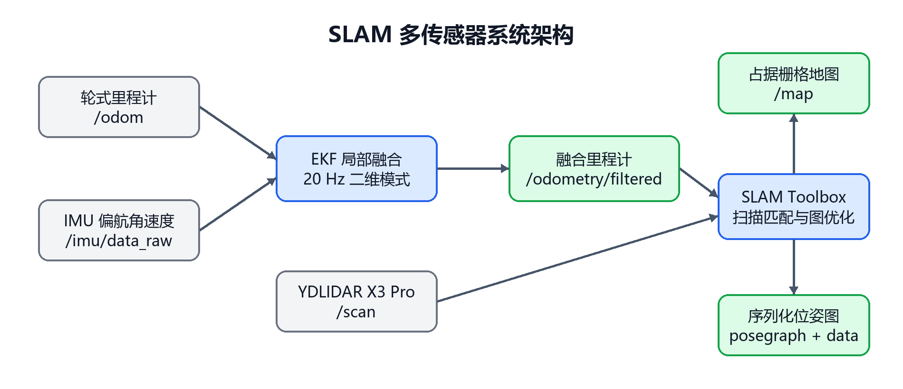
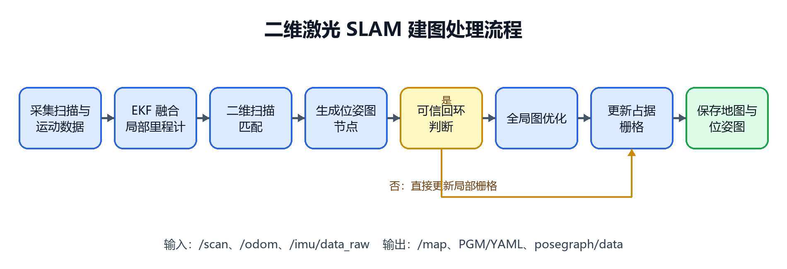
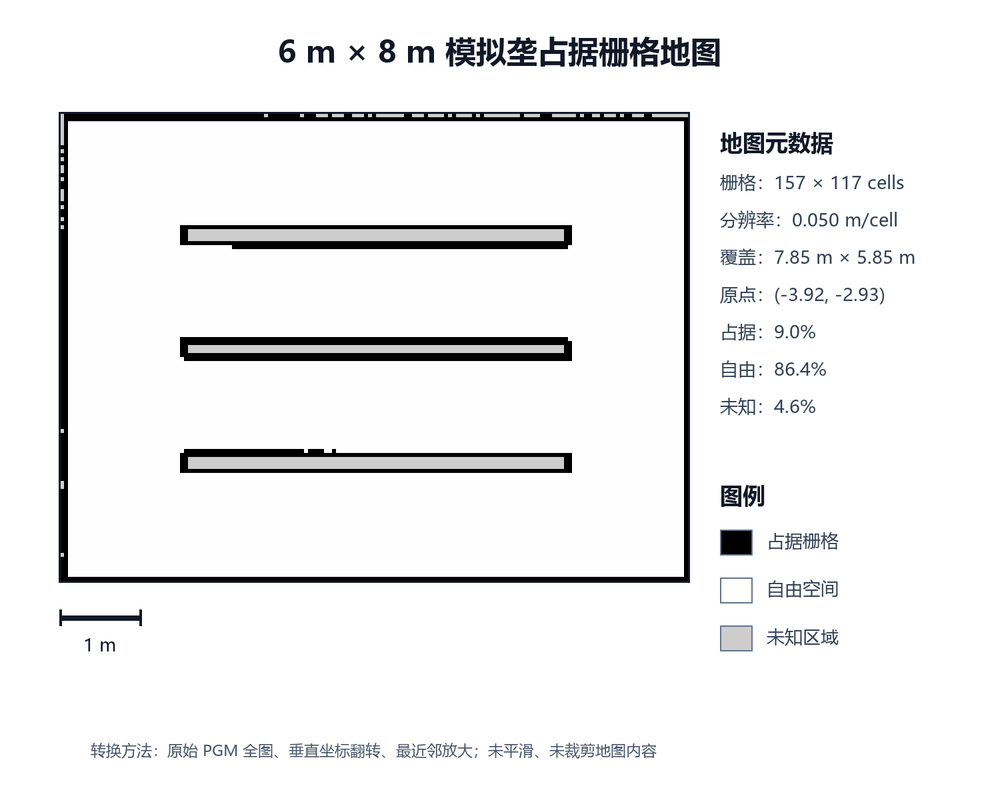

# R-03_SLAM激光雷达建图章节_完整版修订版.docx
- 段落数：66
- 表格数：4
- 图片数：3

机器人二维激光 SLAM 建图技术研究

副标题：建图原理、传感器选型与参数说明

任务编号：R-03

适用项目：基于机器人与 DNA-PCR 技术的孢子病害识别关键技术研究

# 1 任务定位与技术目标

孢子病害识别机器人要在田间完成巡检、采样、检测和数据回传，首先需要建立能够表达垄体、通道、地头和边界的环境地图，并在该地图上持续估计车辆位姿。本章负责二维激光 SLAM 建图子系统，范围包括建图原理、传感器选型、ROS 2 软件结构、关键参数和验证结果。该子系统输出的占据栅格地图与序列化位姿图，既是后续路线跟踪和采样点定位的空间基础，也是把孢子浓度、PCR 检测结果与地块位置关联起来的坐标基础。

围绕比赛提出的系统定位误差小于0.5 m总体目标，本模块采用轮式里程计、惯性测量和二维激光扫描的分层融合结构。底层EKF形成连续局部里程计，SLAM Toolbox通过扫描匹配和位姿图优化修正累计漂移，建立map坐标系下的一致地图。本章以6 m × 8 m模拟垄仿真场景为验证对象，展示传感器配置、建图流程、地图保存及重复建图结果，为小车导航与采样点定位提供空间基础。

本子系统的工程目标为：第一，持续接收 /scan、/odom 与 /imu/data_raw，建立稳定且唯一的 TF 坐标链；第二，面向平行垄道设置高置信度回环约束，生成几何一致的二维地图；第三，以 0.05 m/cell 分辨率保存 PGM/YAML 地图以及可继续优化的 pose graph/data 文件；第四，为后续路径规划、采样点停靠和病害空间分布可视化提供统一的 map 坐标基准。

# 2 传感器选型与系统组成

## 2.1 选型原则

田间建图的核心观测对象是垄边、地头和固定边界。与只提供全局位置的卫星定位不同，二维激光雷达能够直接输出机器人周围障碍物的距离和方位，适合构建占据栅格；与依赖图像纹理的纯视觉方案相比，激光扫描可直接进入成熟的二维扫描匹配链。本项目还要求方案可工程化、可在树莓派 5 和 ROS 2 Humble 环境部署，因此传感器选型不仅考虑量程，还考虑驱动可用性、串口稳定性、坐标标定和故障恢复。

项目选用YDLIDAR X3 Pro作为二维主测距传感器。其360°水平扫描能够同时观察车体两侧垄边与地头结构，项目配置的0.12—8.0 m距离范围适用于6 m × 8 m模拟垄场景的局部几何观测。设备已完成ROS 2驱动集成，通过固定串口别名接入并启用自动重连，便于车载安装、持续采集及运行维护。表1列出项目实际运行配置。

表 1  YDLIDAR X3 Pro 项目运行参数

| 参数 | 配置值 | 工程含义 |
| 通信设备 | /dev/ydlidar | 通过设备别名避免 USB 枚举变化 |
| 波特率 | 115200 bit/s | 与 X3 Pro 串口通信属性一致 |
| 扫描方式 | 单通道，360° | 输出平面 LaserScan，不使用强度值 |
| 扫描频率 | 5.0 Hz | 初始期望转速，接入后以 /scan 实测为准 |
| 距离范围 | 0.12-8.0 m | 与 SLAM 的最小、最大激光距离保持一致 |
| 角度范围 | -180°-180° | 覆盖完整水平视场 |
| 分辨率策略 | 固定分辨率 | 保持扫描数据组织稳定 |
| 异常处理 | 自动重连，异常检查 4 次 | 提高短时通信异常后的恢复能力 |
| 安装修正 | reversion=true，inverted=true | 根据实物前左标定修正扫描朝向和旋转顺序 |
| 坐标系 | laser_link | 通过静态 TF 接入车体坐标链 |

## 2.2 多源传感器分工

系统通过三类观测的互补关系提升建图连续性：STM32底盘驱动发布/odom，提供前向速度和零侧向速度约束；ICM20948发布/imu/data_raw，为当前融合配置提供Z轴角速度；X3 Pro发布/scan，由SLAM Toolbox完成扫描配准、回环检测和全局位姿图优化。EKF输出/odometry/filtered，SLAM发布map→odom，共同形成连续局部运动估计与全局地图校正。

图 1  SLAM 多传感器系统架构

# 3 二维激光 SLAM 建图原理

## 3.1 坐标变换与局部运动估计

X3 Pro 的每个量测由距离和扫描角组成，先转换为 laser_link 平面内的二维点，再通过静态变换投影到 base_link 和 base_footprint。机器人移动后，同一垄边在相邻扫描中的位置会发生变化；扫描匹配算法搜索能够使两帧点集或当前扫描与局部子图最佳对齐的二维位姿增量。轮式里程计提供匹配初值，降低搜索范围；IMU 偏航角速度增强转向期间的短时姿态约束。

robot_localization的EKF以20 Hz运行，采用二维模式，融合轮式里程计的X、Y速度项及IMU的Z轴角速度。变量选择使轮速提供平移约束、惯性观测提供转向约束，为扫描匹配构建连续运动初值，适合垄道直行与地头转弯的运动特点。

## 3.2 扫描匹配与关键帧生成

SLAM Toolbox 接收激光扫描和里程计初值，形成带位姿的扫描节点。系统在机器人累计移动至少 0.08 m 或转动约 0.087 rad 时考虑新增有效节点，并保留 10 帧扫描缓存。相邻节点之间的扫描匹配约束描述局部运动，匹配响应阈值用于筛选有效连接。仓库使用异步节点 async_slam_toolbox_node，使传感器采集和后端优化解耦，适合有限算力平台持续运行。

## 3.3 回环检测与位姿图优化

当机器人重新经过已建区域时，SLAM搜索当前扫描与历史节点之间的一致匹配，并依据距离、响应和方差阈值建立回环约束。回环将历史观测重新关联到统一位姿图中，使累计运动偏差得到全局调整。针对平行垄道的重复几何特征，模拟垄配置通过候选搜索距离、连续匹配链长度及匹配响应阈值联合筛选回环，增强跨时刻关联的可靠性。

位姿图后端使用 CeresSolver，线性求解器为 SPARSE_NORMAL_CHOLESKY，信赖域策略为 Levenberg-Marquardt，并采用 HuberLoss。Huber 损失对小残差保持较高敏感度，同时降低少量大残差约束对整体解的支配程度，适合四轮滑移底盘偶发打滑的工程场景。优化后的节点位姿用于更新 map→odom 变换，并重新投影历史激光扫描生成全局一致地图。

## 3.4 占据栅格地图与地图保存

优化后的扫描射线被写入二维占据栅格：射线穿过区域记为自由空间，终点附近记为占据区域，尚未观察的区域保持未知。项目分辨率为 0.05 m/cell，即每个栅格边长 5 cm。较小栅格有利于表达垄边，但也增加内存、更新和匹配开销；6 m × 8 m模拟垄仿真场景的保存地图为 157 × 117 cells，实际覆盖约 7.85 m × 5.85 m，处于可控规模。

地图保存包含两组互补成果：PGM/YAML用于导航和可视化，YAML记录分辨率、原点及占据阈值；posegraph/data保存扫描节点和约束，可用于继续建图或定位模式。配置、地图验证日志与位姿图同步归档，便于地图复用和重复试验比较。

图 2  二维激光 SLAM 建图处理流程

# 4 ROS 2 软件架构与参数设计

## 4.1 TF 唯一发布者设计

系统采用 map→odom→base_footprint→base_link→laser_link 坐标链。SLAM Toolbox 是 map→odom 的唯一发布者，EKF 是 odom→base_footprint 的唯一发布者，机器人状态发布器负责车体与激光雷达之间的静态变换。底盘驱动在完整栈中关闭自身 odom TF 发布，只保留 /odom 数据输出。这种发布者划分确保坐标变换关系唯一，为扫描投影与地图更新提供一致的坐标基础。

雷达扫描平面在仿真及当前URDF模型中设为离地约0.35 m，位于0.50 m高模拟垄体的可观测范围内。laser_link相对base_link的位置设为X=0.10 m、Z=0.254 m，结合base_link的0.096 m离地高度形成上述扫描平面。模型通过静态坐标变换统一车体与雷达的空间关系，为垄边扫描与地图投影提供几何基础。

## 4.2 SLAM 核心参数

表 2  车载 SLAM Toolbox 基线参数及作用

| 参数 | 配置值 | 作用与设置依据 |
| mode | mapping | 默认进入建图模式，可切换为定位模式 |
| resolution | 0.05 m/cell | 与模拟农田验收和地图保存配置一致 |
| map_update_interval | 2.0 s | 控制占据栅格发布更新周期 |
| transform_publish_period | 0.05 s | 以约 20 Hz 更新 map→odom |
| min_laser_range / max_laser_range | 0.12 / 8.0 m | 与雷达驱动距离过滤范围一致 |
| minimum_time_interval | 0.08 s | 限制连续扫描处理的最短间隔 |
| minimum_travel_distance | 0.08 m | 控制平移关键帧生成密度 |
| minimum_travel_heading | 0.087 rad | 控制旋转关键帧生成密度，约 5° |
| scan_buffer_size | 10 | 保存近期扫描用于匹配 |
| link_scan_maximum_distance | 1.5 m | 限制普通节点关联的空间范围 |
| loop_search_maximum_distance | 3.0 m | 实车基线的回环候选搜索范围 |
| 粗/精回环最小响应 | 0.35 / 0.45 | 拒绝低置信度回环匹配 |
| do_loop_closing | true | 开启闭环漂移修正 |
| occupancy_threshold | 0.1 | 控制扫描写入占据栅格的判定 |

模拟垄场景包含三条走向平行、间距相等的垄体。项目采用sim_mapping.yaml设置场景化回环参数：搜索距离为1.5 m，最小回环链长度为30，粗/精回环最小响应为0.60/0.70，粗匹配最大方差为1.0。该组合以连续且高置信度的匹配证据建立回环，在保留全局优化能力的同时，提高重复垄形环境下的地图一致性。表2列示车载基线配置，模拟垄验证采用本段所列的场景化回环配置。

## 4.3 节点与话题

表 3  建图运行时的主要节点和接口

| 节点或接口 | 输入 | 输出 | 职责 |
| spore_patrol_base_driver | STM32 串口反馈 | /odom、/imu/data_raw | 提供轮速里程计与惯性数据 |
| ydlidar_ros2_driver_node | X3 Pro 串口数据 | /scan | 发布二维激光扫描 |
| ekf_local_filter_node | /odom、/imu/data_raw | /odometry/filtered、odom→base_footprint | 形成连续局部运动估计 |
| slam_toolbox | /scan 与 TF/里程计 | /map、/pose、map→odom | 扫描匹配、回环和地图生成 |
| robot_state_publisher | URDF | /tf_static | 发布车体到传感器静态关系 |
| nav2_map_server 保存工具 | /map | .pgm、.yaml | 导出导航使用的占据栅格 |
| SLAM 序列化服务 | 内部位姿图 | .posegraph、.data | 保存可继续建图和定位的数据 |

统一入口full_stack.launch.py启动底盘反馈、机器人模型、X3 Pro、EKF与SLAM。感知定位服务与路线跟踪控制独立组织，车辆运动由独立控制流程授权，便于建图模块单独启动、检查与系统集成。

# 5 模拟垄建图验证

## 5.1 场景与验收方法

仓库建立了 6 m × 8 m 的固定模拟农田，包含三条沿 X 方向布置的垄体。每条垄长 4.80 m、宽 0.22 m、高 0.50 m，中心线分别位于 Y=-1.42、0 和 +1.42 m，净通道宽 1.20 m，地头长度 1.60 m。试验采用以垄体和固定边界为主要结构的场景，验证基础几何、坐标变换、传感器话题、建图及保存流程。

验证依次检查传感器及地图话题持续发布、TF唯一发布、地图分辨率与覆盖范围、三条垄及边界的连续性，以及PGM/YAML和posegraph/data的完整保存。两次同配置运行以垄中心偏移衡量地图重复性，项目门槛设为0.150 m。验证结果来自独立运行的模拟垄仿真场景。

图 3  6 m × 8 m 模拟垄占据栅格地图。黑色为占据栅格，白色为自由空间，灰色为未知区域；图像由仓库原始 PGM 按 YAML 分辨率与原点进行无插值转换。

## 5.2 验证结果

表 4  已完成的仿真建图验证结果

| 验证项 | 结果 | 判定 |
| 地图尺寸与分辨率 | 157 × 117 cells，0.050 m/cell | 通过 |
| 实际覆盖范围 | 7.85 m × 5.85 m | 通过 |
| 占据/自由/未知栅格 | 1653 / 15871 / 845，分别为 9.0% / 86.4% / 4.6% | 通过 |
| 首次运行三条垄覆盖率 | 100.0% / 100.0% / 100.0% | 通过 |
| 首次运行垄线离散 | 0.018 / 0.003 / 0.030 m | 最大 0.030 m，通过 |
| 第二次运行三条垄覆盖率 | 100.0% / 100.0% / 99.0% | 通过 |
| 两次地图垄中心偏移 | 0.050 / 0.050 / 0.050 m | 低于 0.150 m 门槛，通过 |
| 地图与位姿图保存 | PGM/YAML、posegraph/data 均生成 | 通过 |
| 仿真离线测试复跑 | 10 项全部通过 | 通过 |

上述结果证明了固定仿真场景下的话题链、建图链、保存链、地图几何质量和同配置重复性。首次地图三条垄覆盖率均达到 100%，最大垄线离散为 0.030 m；本次复核再次运行仓库比较工具，得到三条垄中心偏移均为 0.050 m，低于 0.150 m 门槛，同时 10 项模拟场景与地图验证测试全部通过。

本章以垄覆盖率、垄线离散和两次地图垄中心偏移评价模拟垄场景中的地图完整性、几何一致性与重复性。上述指标共同反映建图模块的环境表达质量，为导航与采样任务提供地图基础。

# 6 技术特点与工程实现

## 6.1 面向重复垄道的回环约束优化

平行垄道具有相似的激光轮廓。本项目采用短距离候选搜索、较高匹配响应、较长连续匹配链及粗匹配方差约束，并保留回环优化能力，形成面向农业平行结构的场景化建图配置。验证结果中，两次独立运行的垄中心偏移均为0.050 m，体现了同配置下地图几何表达的重复性。

## 6.2 TF 所有权与安全启动解耦

系统将map→odom、odom→base_footprint和车体静态TF分配给不同且唯一的发布者，并将感知定位服务与路线跟踪控制解耦。定位服务可在车辆静止状态下启动，运动输出由独立路线控制流程管理。该设计明确了传感器采集、局部融合及全局建图之间的职责，便于模块集成与运行维护。

## 6.3 场景适配与地图复用

系统采用固定串口别名与自动重连，支持传感器持续接入；通过统一的机器人模型和静态坐标变换，将雷达扫描与车体运动关联到同一坐标体系。模拟垄配置针对平行几何结构设置回环筛选条件，并以两次同配置建图检验地图重复性，使传感器接入、位姿估计和地图验证形成完整流程。

地图成果同时保留栅格文件、位姿图及验证记录，可根据任务需要加载地图或继续建图。占据栅格表达通道和垄体边界，位姿图保留观测间的关联，两类成果为后续路线规划与采样位置标注提供可复用的空间数据。

# 7 结论

本项目已经形成可部署的二维激光 SLAM 建图方案：YDLIDAR X3 Pro 提供 360°平面扫描，轮式里程计与 ICM20948 偏航角速度经 EKF 形成连续局部运动估计，SLAM Toolbox 使用二维扫描匹配、回环检测和 Ceres 位姿图优化建立占据栅格地图。软件采用 ROS 2 Humble，明确了 TF 唯一发布者规则，并能同时保存导航地图和序列化位姿图。

6 m × 8 m模拟垄仿真验证已完成建图与地图保存检查：首轮三条垄覆盖率均为100%，第二轮分别为100%、100%和99%；首轮最大垄线离散为0.030 m，两次地图垄中心偏移均为0.050 m，优于项目设定的0.150 m重复性门槛，配套10项离线验证测试全部通过。结果体现了本方案在模拟垄场景下的地图完整性与重复性，为小车垄间通行及采样任务提供了统一地图坐标基础。
