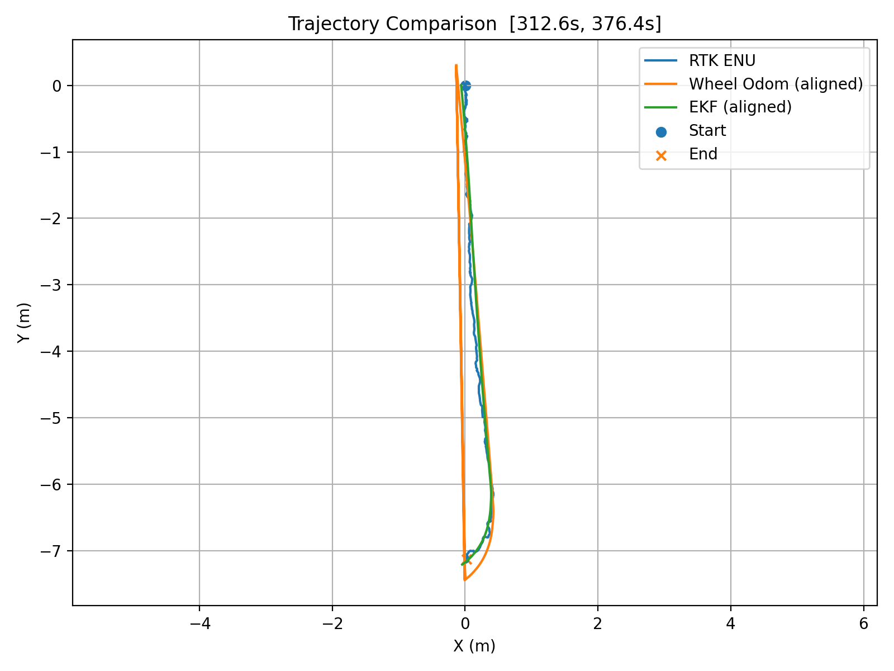

# 北斗.docx
- 段落数：123
- 表格数：4
- 图片数：1

## 1 北斗卫星定位系统设计

对孢子病害监测机器人在田间巡检过程中对自主定位精度和长期运行稳定性的需求，本文设计了一套基于北斗RTK（Real-Time Kinematic，实时动态差分定位）技术的高精度定位系统，并将RTK绝对定位信息与激光SLAM局部定位结果进行融合，实现机器人在室外复杂环境下的稳定定位。

本系统引入RTK差分定位技术，通过基准站提供的差分改正信息，提高卫星定位精度，并结合机器人自身传感器信息实现多源融合定位。

系统整体由RTK卫星定位模块、差分数据通信链路、车载计算平台、ROS 2定位节点以及融合定位算法模块组成

系统总体数据处理流程为：

其中，RTK接收机负责接收北斗/GNSS卫星信号，并通过NTRIP（Networked Transport of RTCM via Internet Protocol）网络获取参考站提供的RTCM差分改正数据。接收机结合自身观测信息完成载波相位差分解算，在满足条件时输出RTK Fixed固定解状态。

该结构将卫星绝对定位信息与机器人自身的局部坐标体系进行衔接，为后续路径规划、航迹跟踪及多源定位融合提供位置数据基础。

### 1.1 RTK差分定位原理

RTK（Real-Time Kinematic）通过参考站与流动站之间的差分观测，削弱卫星钟差、大气延迟等空间相关误差，并利用载波相位观测实现高精度相对定位。

RTK系统通常包括参考站、流动站以及差分数据传输链路。参考站具有已知或经过高精度测量的坐标，同时接收卫星观测数据，并将差分改正信息发送给流动站。流动站同时接收卫星信号和参考站发送的差分改正数据，通过载波相位差分解算获得自身的高精度位置。

对于基准站和流动站同时观测的第颗卫星，可以构造单差观测：

式中，表示流动站对第颗卫星的观测量，表示参考站对应观测量。

通过参考站与流动站之间的差分，可以削弱部分卫星钟差、接收机钟差以及大气传播误差。进一步采用双差观测，可以进一步消除接收机钟差和卫星钟差等公共误差，从而提高定位精度。

RTK的核心优势在于同时利用伪距和载波相位观测，并通过差分处理提高定位精度。当载波相位整周模糊度得到正确固定时，可获得厘米级相对定位结果。

RTK解算过程中，整周模糊度的求解状态决定最终定位精度。

当接收机无法确定整周模糊度时，系统处于RTK Float状态，此时定位精度通常为分米级。

当系统成功完成整周模糊度固定后，进入RTK Fixed状态，此时载波相位观测量能够充分发挥作用，实现厘米级甚至更高精度的相对定位。

RTK定位状态转换过程如下：

本项目采用K988 RTK接收机，通过NTRIP网络获取RTCM差分改正信息，在实际测试过程中成功获得RTK Fixed状态，并将固定解结果用于后续融合定位实验。

### 1.2 RTK硬件系统设计

为了满足巡检机器人在室外环境下高精度定位需求，本文搭建了一套基于北斗RTK的车载定位硬件系统。系统主要由RTK接收机、GNSS天线、差分数据通信链路以及车载计算平台组成。

其中，RTK接收机采用 K988 RTK定位模块，负责接收北斗/GNSS卫星观测数据，并结合外部差分改正信息完成高精度定位解算。GNSS天线安装于机器人顶部，用于提高卫星信号接收质量，减少机器人结构遮挡和多路径效应影响。

差分定位过程中，系统通过NTRIP网络服务获取基准站提供的RTCM差分改正数据。RTK接收机接收到差分信息后，与自身卫星观测数据进行融合解算，当整周模糊度成功固定后输出RTK Fixed定位结果。

车载计算平台采用树莓派作为机器人主控设备，负责完成RTK数据接收、协议解析、坐标转换以及融合定位算法运行。

表1 RTK定位系统硬件组成

| 设备 | 功能 |
| K988 RTK接收机 | 接收卫星信号并完成RTK差分解算 |
| GNSS双频天线 | 接收北斗/GNSS卫星信号 |
| NTRIP差分服务 | 提供RTCM差分改正数据 |
| USB/串口通信模块 | 实现RTK接收机与主控计算机通信 |
| Raspberry Pi车载计算平台 | 运行ROS 2节点及融合定位算法 |
| IMU/轮速计 | 提供机器人运动状态信息 |
| 激光雷达 | 提供SLAM环境定位信息 |

在实际部署过程中，RTK天线固定安装于机器人顶部位置，使天线尽可能保持无遮挡视野，提高卫星信号质量。

K988 RTK接收机通过USB串口与树莓派连接，输出标准NMEA定位数据。树莓派运行Ubuntu系统和ROS 2环境，对接收到的RTK数据进行解析，并进一步转换为机器人导航系统使用的坐标形式。

### 1.3 RTK数据接入与坐标转换

1.3.1 RTK数据ROS 2接入

为了实现RTK定位结果与机器人导航系统融合，本文基于ROS 2框架设计了GNSS定位数据处理节点。

RTK接收机输出标准NMEA定位信息，通过串口通信方式传输至车载计算机。ROS 2定位节点负责完成：

（1）串口数据读取；

（2）NMEA协议解析；

（3）定位状态判断；

（4）经纬高信息发布；

（5）坐标转换与融合接口输出。

系统主要发布的话题如表2所示

表2 RTK ROS 2数据接口

| 话题 | 消息类型 | 作用 |
| /fix | sensor_msgs/NavSatFix | 发布RTK经纬度及高度 |
| /gps/status | std_msgs/String | 发布RTK状态、卫星数量、HDOP |
| /gps/raw_nmea | std_msgs/String | 保存原始NMEA数据 |
| /gps/enu | geometry_msgs/PointStamped | 发布ENU局部坐标 |
| /gps/velocity | geometry_msgs/Vector3Stamped | 发布速度及航向信息 |

1.3.2 WGS84坐标转换至ENU局部坐标系

RTK接收机输出的位置通常采用WGS84地理坐标形式：

其中：纬度；经度；高程。

本系统采用WGS84椭球模型进行坐标转换。根据WGS84椭球模型将地理坐标转换为ECEF地心地固坐标，然后以指定参考点作为局部坐标原点，计算当前位置相对于参考点的空间位置，最后通过参考点的经纬度建立ECEF到ENU的旋转关系。

ECEF坐标系：

其中：

其中，a为WGS84长半轴，为WGS84第一偏心率。

参考原点为

得到当前位置与参考点之间的ECEF坐标差：

再通过参考点的经纬度建立ECEF到ENU的旋转关系:

ENU坐标系由East、North和Up三个方向组成，其中：

E：东向、N：北向、U：天向

经过转换后，RTK输出的经纬度坐标被转换为机器人能够直接使用的米制坐标。

1.3.3 RTK坐标与机器人地图坐标转换

为了实现RTK定位结果与SLAM地图坐标统一，需要进一步完成ENU坐标系与机器人map坐标系之间的转换。

设RTK输出的局部坐标为：

初始地图位置为

初始航向角为

则可以通过二维刚体变换得到地图坐标：

同时，目标航向角可以表示为

该变换在项目代码中被实现为独立的纯数学模块，不依赖ROS状态，因此可以通过单元测试验证其正确性。

该结构使北斗定位信息能够从原始地理坐标进一步转换为机器人导航系统可使用的局部坐标，而不仅停留在经纬度数据显示层面。

### 1.4 RTK-SLAM融合定位方法

1.4.1 多源融合定位思想

单一定位方式在复杂室外环境中存在一定局限性。RTK能够提供具有全球参考意义的高精度绝对位置，但在卫星遮挡、无线差分链路波动等情况下可能出现短时数据异常；SLAM能够利用激光雷达等环境特征实现连续定位，但随着机器人运动时间增加，局部位姿估计可能产生累计漂移。因此本文采用多传感器融合思想，将RTK绝对定位信息与SLAM、IMU以及轮式里程计信息进行融合，提高机器人定位系统的稳定性和鲁棒性。

1.4.2 ROS2融合定位实现

本文基于ROS 2机器人软件框架实现RTK与SLAM融合定位。

系统主要包含以下节点：RTK定位节点；SLAM节点；robot_localization EKF节点

通过RTK定位节点实现：接收K988输出数据； 解析NMEA报文； 发布RTK位置消息；完成WGS84→ENU转换。

基于激光雷达扫描数据，通过SLAM Toolbox建立环境地图，并输出机器人局部位姿。

robot_localization EKF节点负责融合：RTK位置约束； SLAM位姿信息； IMU姿态信息；轮式里程计速度信息。

最终输出统一坐标系下机器人状态：

该融合结构避免了单一传感器定位的不足，使机器人能够同时具备：RTK提供的全局一致性； SLAM提供的局部环境适应能力；IMU提供的短时运动稳定性。

### 1.6 融合定位实验与精度分析

为了验证RTK与SLAM融合定位系统的有效性，本文基于机器人实际运行rosbag数据开展融合定位实验。

实验过程中同步记录：RTK Fixed状态下的ENU轨迹； EKF融合定位轨迹。

由于RTK Fixed状态下定位结果具有较高可靠性，因此选取RTK固定解稳定时间段作为评价区间，并将RTK ENU轨迹作为参考轨迹，对EKF融合轨迹进行二维刚体对齐后计算误差指标。

实验评价区间如下：

表3 融合定位实验参数

| 参数 | 数值 |
| 数据来源 | 车辆实测rosbag |
| RTK状态 | RTK Fixed |
| 有效时间区间 | 312.6 s ～ 376.4 s |
| 有效测试时长 | 63.8 s |
| 参考轨迹 | RTK ENU |
| 融合算法 | robot_localization EKF |

实验过程中，RTK ENU轨迹与EKF融合定位轨迹对比如图所示。

图1 RTK ENU轨迹与EKF融合轨迹对比

在有效测试时间内，EKF融合轨迹整体趋势与RTK参考轨迹高度一致，融合轨迹能够较好保持：起始位置一致性； 运动方向一致性； 转弯过程连续性。

说明融合定位算法能够有效利用RTK提供的绝对位置约束，同时保持SLAM定位结果的连续性。

为了定量评价融合定位性能，本文计算EKF融合轨迹与RTK参考轨迹之间的二维位置误差。

表4 融合定位误差分析

| 指标 | 结果 |
| 有效时间 | 63.8 s |
| MAE | 0.044 m |
| RMSE | 0.049 m |
| P95 | 0.082 m |
| 最大误差 | 0.117 m |
| ≤0.5m比例 | 100% |

实验结果表明，基于RTK与SLAM融合的定位方案能够满足巡检机器人室外高精度定位需求。

具体表现为：

（1）RTK Fixed状态提供了稳定的绝对位置约束，有效降低了SLAM长时间运行产生的累计漂移；

（2）SLAM提供连续局部位姿估计，提高了机器人运动过程中的定位连续性；

（3）EKF融合算法能够合理利用不同传感器信息，实现多源数据优势互补。

在63.8 s有效测试区间内，融合定位结果相对于RTK参考轨迹的：

MAE为0.044 m；

RMSE为0.049 m；

P95误差为0.082 m；

最大误差为0.117 m。

所有测试点误差均小于0.5 m，满足项目对于室外巡检机器人高精度定位的设计要求。

### 1.7 小节

本章针对孢子病害监测机器人室外自主巡检过程中的高精度定位需求，设计并实现了一套基于北斗RTK与SLAM融合的定位系统。

首先，分析了RTK差分定位原理，阐述了基于载波相位差分的高精度定位方法；随后介绍了K988 RTK接收机、NTRIP差分服务以及车载计算平台组成的硬件系统，并完成RTK数据在ROS 2框架中的接入。

在软件层面，系统实现了RTK数据解析、WGS84到ENU局部坐标转换以及地图坐标转换，使卫星定位结果能够与机器人导航坐标体系统一。进一步结合SLAM、IMU和轮式里程计信息，通过EKF算法实现多源融合定位。

最后，基于车辆实际运行rosbag数据进行了融合定位实验。实验结果表明，在RTK Fixed状态有效区间内，EKF融合定位结果与RTK参考轨迹具有较高一致性，MAE为0.044 m，RMSE为0.049 m，P95误差为0.082 m，最大误差为0.117 m，误差全部控制在0.5 m以内。

结果验证了所设计北斗RTK融合定位系统在室外巡检机器人应用场景中的有效性和可靠性，为后续自主导航、路径规划以及精准巡检任务提供了稳定的位置基础。
