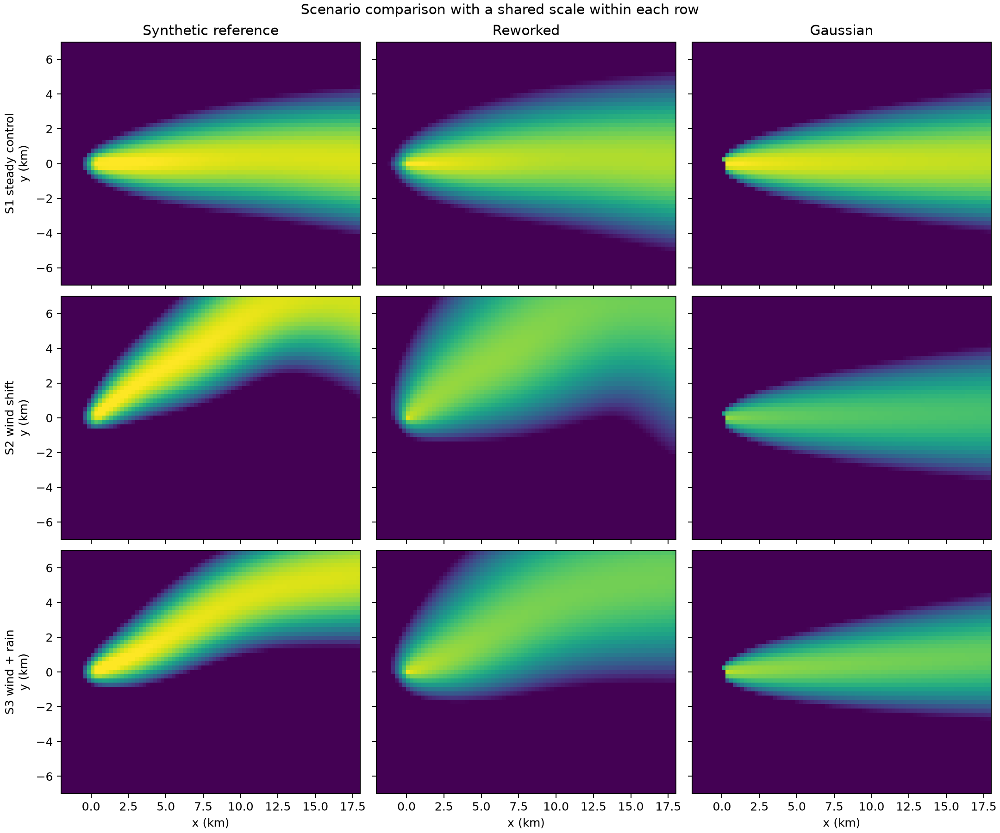
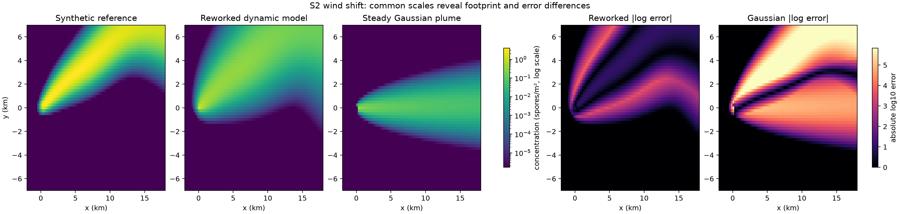
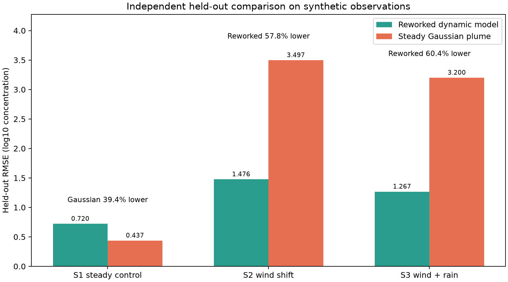

# 模拟数据对比说明

生成日期：2026-09-06  
数据性质：**合成模拟数据，不是真实农田观测**  
随机种子：`20260906`  

## 实验结论

本实验使用独立的动态高斯烟团集合生成合成参考场，并比较粗网格动态 Eulerian 离线代理与单一稳态高斯烟羽。每个场景包含 80 个观测位置，其中 20 点只用于浓度尺度校准，以下指标全部在另外 60 个留出点上计算。

| 场景 | 重构 RMSE | 高斯 RMSE | 重构相关系数 | 高斯相关系数 | 重构热点 IoU | 高斯热点 IoU | RMSE 结论 |
|---|---:|---:|---:|---:|---:|---:|---|
| S1 稳定风场 | 0.720 | 0.437 | 0.966 | 0.988 | 0.900 | 0.778 | 高斯低 39.4% |
| S2 风向转折 | 1.476 | 3.497 | 0.849 | -0.322 | 0.581 | 0.029 | 重构低 57.8% |
| S3 风向变化与阵雨 | 1.267 | 3.200 | 0.879 | -0.052 | 0.783 | 0.031 | 重构低 60.4% |

动态场景 S2/S3 的平均 RMSE：重构算法 1.372，高斯烟羽 3.349，重构算法降低约 59.0%。稳态 S1 中高斯模型更好，符合其适用假设，也使对比结论更可信。

## 热力图

## 可用于正文的表述

> 在独立动态烟团生成的合成参考场中，稳态条件下传统高斯烟羽仍保持较低误差；当风向发生转折或同时存在阵雨清除和时变释放时，动态重构算法的留出点 log10 RMSE 分别降低 57.8% 和 60.4%，且在热力图中能够恢复传统稳态烟羽无法表达的弯折传播带。

必须注明：该结论仅反映受控合成环境中的模型能力，不代表真实农田准确率。

## 数据文件

- `synthetic_observations.csv`：240 条合成观测记录，包含训练/测试标记、参考浓度和两种模型预测。
- `scenario_metrics.csv`：便于直接复制到报告或表格软件的汇总指标。
- `scenario_metrics.json`：包含场景说明、参数边界、数据状态和完整指标。
- `generate_report_simulation.py`：固定种子的完整重现脚本。
