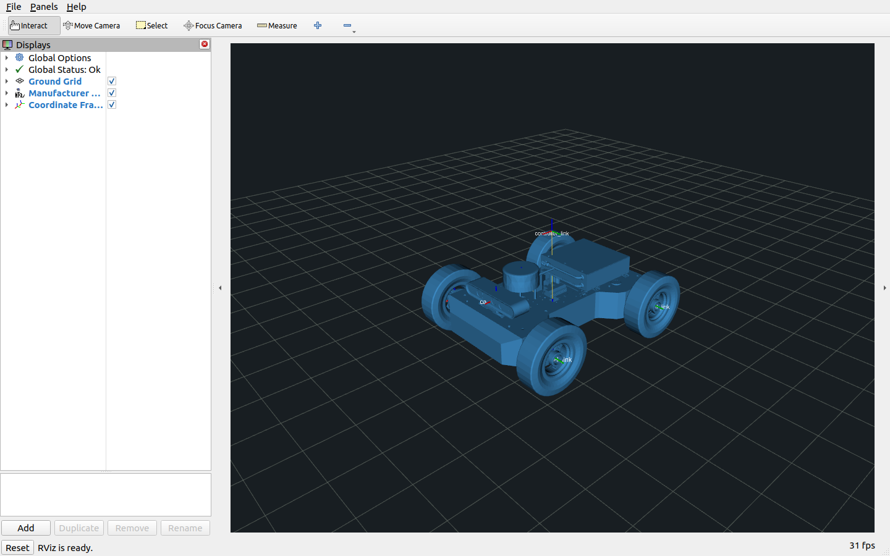
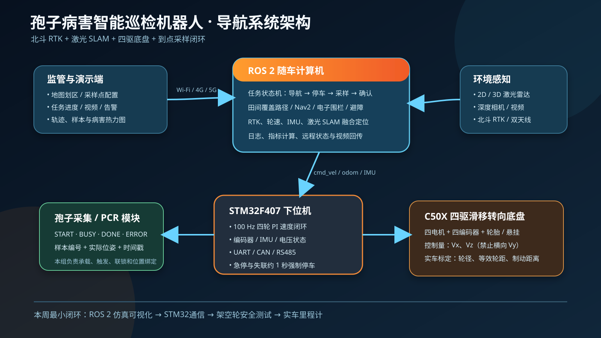

# Spore Patrol Robot

面向“基于机器人与 DNA-PCR 技术的孢子病害识别”项目的 ROS 2 机器人导航工作区。
本仓库只负责机器人底盘、定位、导航、路径规划和硬件联调；孢子收集及生物检测由其他
小组负责。

## 当前状态

已确认实车为 WHEELTEC 高配摆式悬挂四驱底盘：

- STM32F407 下位机；
- MD36L-P27 电机，24 V、60 W、1:27 减速比；
- 500 线 AB 相 GMR 编码器，STM32 四倍频计数；
- 152 mm 越野轮；
- 图纸轴距 312.7 mm、轮中心距约 335.6 mm；
- 裸车质量约 7.6 kg，24 V 6000 mAh 电池。

详细参数及“图纸尺寸”和“固件有效运动学参数”的区别见
[高配摆式悬挂底盘参数](docs/小车相关参数/README.md)。

### 已完成

- 高配摆式底盘 Xacro/URDF 模型和 ROS 坐标系；
- Gazebo Classic 简化农田场景及二维激光雷达仿真；当前阶段 C 首轮场景为
  `src/spore_patrol_sim/worlds/farmland_8x6.world`，几何参数和离线检查见
  `src/spore_patrol_sim/config/farmland_layout.json` 与 `tools/validate_farmland_layout.py`；
- canonical 模拟农田已完成一次 ROS 2 Humble/Gazebo/SLAM Toolbox 实际建图，固定闭环、地图保存、栅格检查和三垄几何检查均通过；结果见
  `tests/results/20260831_135053_sim_farmland_8x6/`，执行说明见
  `../spore-vehicle-nav/docs/模拟农田建图测试.md`；
- STM32 11 字节速度命令和 24 字节状态反馈协议；
- ROS 2 串口底盘驱动；
- `/cmd_vel` 控制、轮式 `/odom`、`odom -> base_footprint` TF；
- `/imu/data_raw`、`/battery_state` 和 `/diagnostics`；
- 上位机 0.30 秒命令看门狗、STM32 通信失联停车；
- 速度和加速度限制、低电压诊断、串口断线重连；
- 独立串口测试工具、原始字节记录、CSV 和测试摘要；
- 3 m 直线、原地旋转、四轮动作和失联停车实车测试。
- YDLIDAR X3 Pro 官方驱动、固定版本 SDK、ROS 2 启动和自动数据检查；
- X3 Pro 实物 USB/CP210x 通信、`/scan`、TF、方向和 RViz 联调；
- 底盘、雷达、机器人模型和 RViz 的统一实车启动入口；
- SLAM Toolbox 异步建图配置、专用 RViz、录包和地图保存工具；
- `spore_patrol_localization` 本地 EKF 配置和组合启动入口，使用轮速平移与
  ICM20948 偏航角速度，并自动保证 TF 只有一个发布者。

当前实测基线：

- STM32 状态反馈约 20 Hz；
- 编码器目标 3.000 m 对应卷尺距离约 3.05 m；
- 90°和 360°原地旋转表现正常，仍需补充重复测量数据；
- 失联停车已通过一次现场测试，修改或重新烧录固件后必须复测。
- X3 Pro 能稳定启动并显示环境轮廓，左右/前后方向已用实物箱体确认。

### 尚未完成

- X3 Pro 长时间稳定性、室外强光和植株环境数据评估；
- 室内/小花园实机二维地图、重复建图误差和 rosbag；仿真首轮地图已通过结构与三垄几何验收，不能替代实机证据；
- 北斗 RTK、航向和 CORS/NTRIP 链路；
- 本地 EKF 实车验证，以及 CMP10A、GNSS 和 SLAM 的全局融合；
- Nav2 静态地图定位、规划和动态避障；
- 田间往复式覆盖路径和电子围栏；
- “到点—停车—采样—确认—继续”任务状态机；
- 携带完整载荷后的质量、重心、续航和越障复测。

## 工作区结构

```text
spore_patrol_ws/
├── src/
│   ├── spore_patrol_base_driver  STM32协议、串口、里程计、IMU、电池、诊断
│   ├── spore_patrol_description  高配摆式底盘URDF/Xacro和RViz配置
│   ├── spore_patrol_lidar        YDLIDAR X3 Pro参数、启动和RViz配置
│   ├── spore_patrol_slam         SLAM Toolbox建图参数、启动和RViz配置
│   ├── spore_patrol_localization  轮速和ICM20948本地EKF融合
│   ├── spore_patrol_sim          Gazebo农田世界及激光雷达仿真
│   └── spore_patrol_bringup      仿真、原始实车和融合实车启动入口
├── tests/
│   ├── chassis_serial            不依赖ROS运行时的底盘测试程序
│   ├── lidar                     雷达端口、数据质量和方向检查程序
│   ├── slam                      建图录包工具和现场操作说明
│   ├── results                   现场原始数据和测试结果
│   └── templates                 测试记录模板
├── maps/                         保存的二维地图和SLAM位姿图
├── tools/                        依赖安装、udev、建图保存等辅助脚本
└── docs/                         参数、协作说明和汇报材料
```

后续计划增加：

```text
spore_patrol_navigation    Nav2规划、控制与避障
spore_patrol_coverage      田间覆盖路径
spore_patrol_mission       采样任务状态机
```

## 环境

- Ubuntu 22.04
- ROS 2 Humble
- Gazebo Classic 11
- Python 3.10

## 编译

主工作区位于 Ubuntu ext4 分区的 `~/spore_patrol_ws`，可以使用
`--symlink-install`，源码修改后通常不需要重复复制 Python、launch、URDF 和配置文件：

```bash
cd ~/spore_patrol_ws
source /opt/ros/humble/setup.bash
sudo apt-get install -y ros-humble-robot-localization
tools/setup_ydlidar_dependencies.sh
source tools/ydlidar_env.sh
colcon build --symlink-install --packages-up-to spore_patrol_localization
source install/setup.bash
```

`setup_ydlidar_dependencies.sh` 只需首次运行或依赖版本改变后运行。以后编译和启动
雷达前仍需 `source tools/ydlidar_env.sh`。第三方 SDK/驱动使用
`dependencies/ydlidar.repos` 锁定版本，不提交到本仓库。

不要再从 `/media/brown/新加卷*` 下的旧副本编译或启动，避免生成两套不同绝对路径的
`build/install/log`。

离线测试：

```bash
python3 -m unittest -v tests/chassis_serial/test_protocol.py
python3 tests/chassis_serial/chassis_serial_test.py selftest
```

当前验证结果为：

```text
ROS 2底盘、模型、雷达、仿真、bringup和SLAM包构建成功
底盘包colcon测试：8项通过
全部Python测试：17项通过
URDF/Xacro解析通过
SLAM启动参数、YAML和安装路径检查通过
```

## 不连接小车查看模型

```bash
source /opt/ros/humble/setup.bash
source install/setup.bash
ros2 launch spore_patrol_description display.launch.py
```

该启动文件会临时发布静态 `odom -> base_footprint`。不要与实车
`hardware.launch.py` 同时运行，否则会重复发布同一段 TF。

### 厂家 STEP 精细模型预览

厂家提供的“高配摆式悬挂四驱车（带外壳）”STEP 装配已经转换为 RViz 可读取的
STL 外观网格。该模型约 24.2 万个三角面，只用于核对结构、制作汇报截图和辅助
规划传感器安装位置：

```bash
source /opt/ros/humble/setup.bash
source install/setup.bash
ros2 launch spore_patrol_description vendor_model_preview.launch.py
```



精细网格不能用作 Gazebo 或 Nav2 碰撞体，否则会显著降低仿真和规划性能。实际
导航仍使用当前的盒体、圆柱等简化碰撞几何。厂家原始 URDF 引用的分零件 STL
没有随文件提供，因此当前预览采用 STEP 整体网格，不包含可独立转动的轮子关节。

## Gazebo农田演示

```bash
source /opt/ros/humble/setup.bash
source install/setup.bash
ros2 launch spore_patrol_bringup demo.launch.py
```

另开终端控制：

```bash
source /opt/ros/humble/setup.bash
source install/setup.bash
ros2 run teleop_twist_keyboard teleop_twist_keyboard
```

Gazebo 当前使用平面运动插件，只适合展示话题、TF、场景和传感器链路，不代表真实四驱
滑移转向动力学，也不能作为 Nav2 控制器参数已经验证的依据。

## YDLIDAR X3 Pro

当前已完成 X3 Pro 的驱动、参数、URDF、启动和测试工具。先识别 CP210x 端口：

```bash
python3 tests/lidar/lidar_test.py ports
```

单独启动雷达和 RViz：

```bash
source /opt/ros/humble/setup.bash
source tools/ydlidar_env.sh
source install/setup.bash
ros2 launch spore_patrol_lidar lidar_view.launch.py \
  port:=/dev/ttyUSB0
```

另开终端运行 30 秒自动检查：

```bash
source /opt/ros/humble/setup.bash
source tools/ydlidar_env.sh
source install/setup.bash
python3 tests/lidar/lidar_test.py scan --duration 30
```

当前 Gazebo 验证结果为 4.964 Hz、每圈 600 点、约 0.601°；实物 X3 Pro 已确认
能够发布 `/scan`，坐标系为 `laser_link`，并已通过箱体位置检查修正方向。最近一次
30 秒实测约 12.0 Hz、每圈 340 点、有效点中位数 199。长时间稳定性和室外表现
仍需保存正式现场记录。
完整的首次安装、`reversion/inverted` 判断、故障排查和阶段验收见
[YDLIDAR X3 Pro 接入、调试与后续工作](docs/激光雷达接入与调试.md)。

## 室内二维建图

当前建图链路使用轮式 `/odom`、X3 Pro `/scan` 和 SLAM Toolbox，不会自动向
`/cmd_vel` 发布运动命令；小车只会在操作者另行启动键盘遥控并按键后运动。

```bash
source /opt/ros/humble/setup.bash
source tools/ydlidar_env.sh
source install/setup.bash
ros2 launch spore_patrol_slam mapping.launch.py \
  base_port:=/dev/ttyACM0 \
  lidar_port:=/dev/ydlidar \
  rviz:=true
```

建图时先运行 `tests/slam/record_mapping_bag.sh` 保存可复现数据，低速绕行并回到
起点后运行：

```bash
tools/save_slam_map.sh indoor_01
```

完整步骤、验收标准和故障判断见
[ICM20948融合与室内二维建图操作指南](docs/室内二维建图.md)。

## 真实底盘ROS 2驱动

先确认串口：

```bash
python3 tests/chassis_serial/chassis_serial_test.py ports
```

启动底盘驱动、机器人模型和 RViz：

```bash
source /opt/ros/humble/setup.bash
source install/setup.bash
ros2 launch spore_patrol_bringup hardware.launch.py \
  port:=/dev/ttyACM0 \
  lidar:=true \
  lidar_port:=/dev/ydlidar \
  rviz:=true
```

如果没有连接小车，驱动不会收到状态帧，也不会发布动态
`odom -> base_footprint`，RViz 会提示 `Frame [odom] does not exist`。这是预期现象，
不代表 URDF 损坏。

驱动默认参数：

| 参数 | 默认值 | 说明 |
|---|---:|---|
| 串口 | `/dev/ttyACM0` | 推荐后续配置固定 udev 名称 |
| 波特率 | 115200 | STM32 ROS 串口 |
| 发送频率 | 20 Hz | 持续发送速度或停车帧 |
| 命令超时 | 0.30 s | 超时立即发送零速度 |
| 最大线速度 | 0.15 m/s | 当前低速联调限制 |
| 最大角速度 | 0.30 rad/s | 当前低速联调限制 |
| 最大线加速度 | 0.40 m/s² | 正常控制指令斜坡 |
| 最大角加速度 | 0.80 rad/s² | 正常控制指令斜坡 |
| 低电压警告 | 21.0 V | 发布 WARN 诊断 |
| 严重低电压 | 20.0 V | 发布 ERROR 诊断 |

主要话题：

| 方向 | 话题 | 类型 |
|---|---|---|
| 订阅 | `/cmd_vel` | `geometry_msgs/msg/Twist` |
| 发布 | `/odom` | `nav_msgs/msg/Odometry` |
| 发布 | `/imu/data_raw` | `sensor_msgs/msg/Imu` |
| 发布 | `/battery_state` | `sensor_msgs/msg/BatteryState` |
| 发布 | `/diagnostics` | `diagnostic_msgs/msg/DiagnosticArray` |

运行检查：

```bash
ros2 topic hz /odom
ros2 topic echo /imu/data_raw --once
ros2 topic echo /battery_state --once
ros2 topic echo /diagnostics --once
ros2 run tf2_ros tf2_echo odom base_footprint
```

## 本地轮速和 ICM20948 融合

[`spore_patrol_localization`](src/spore_patrol_localization/README.md) 使用二维 EKF：

- `/odom` 只提供车体前向速度和零横向速度；
- `/imu/data_raw` 保留 STM32 原始 ICM20948 数据；
- `/imu/data_calibrated` 是启动静止10秒后完成零偏补偿的角速度，供 EKF 使用；
- `/odometry/filtered` 提供融合后的本地里程计；
- EKF 是唯一的 `odom -> base_footprint` TF 发布者。

实车启动：

```bash
source /opt/ros/humble/setup.bash
source install/setup.bash

ros2 launch spore_patrol_localization hardware_localization.launch.py \
  port:=/dev/ttyACM0 \
  lidar:=false \
  rviz:=true
```

检查：

```bash
ros2 topic hz /imu/data_raw
ros2 topic hz /imu/data_calibrated
ros2 topic hz /odometry/filtered
ros2 run tf2_ros tf2_echo odom base_footprint
```

启动后必须保持小车完全静止10秒，看到终端输出 `Gyro bias calibration complete` 后再运动。
组合启动会把底盘驱动的 `publish_tf` 设为 `false`，避免与 EKF 重复发布动态 TF。
不能同时运行原始 `hardware.launch.py` 和融合启动文件，因为两个进程都会尝试打开
同一个 STM32 串口。CMP10A 后续使用独立坐标系和绝对航向话题接入，不与 ICM20948
作为同等角速度源直接重复融合。

## STM32底盘现场测试

开始前必须完整阅读[底盘测试操作说明](tests/README.md)。测试工具支持：

- 查找串口、监听反馈和连续发送停车帧；
- 架空轮前进、后退、左转、右转；
- 3 m 编码器距离测试；
- 90°和 360°原地旋转测试；
- 通信失联停车测试；
- 不连接实车的伪 STM32 和协议单元测试。

每次新测试会保存：

```text
tests/results/时间_测试类型/
├── metadata.json  命令参数、串口和开始时间
├── summary.json   帧率、校验统计、结论、滑行或过转结果
├── frames.csv     速度、原始IMU、SI单位IMU和电池逐帧数据
└── raw.bin        未经处理的串口原始字节
```

测试工具会自动发送停车帧，但不能替代人员看守的物理急停。

## 固件说明

- `_4WD_CAR` 是当前需要编译的 Keil 工程目标；
- 高配摆式车型对应 `SENIOR_4WD_BS`、`MD36N_27`、`GMR_500` 和
  `WheelDiameter_4WD_152`；
- `SYSTEM/sys/sys.c` 中 `SecurityLevel=0`，启用串口命令丢失停车；
- `CarType/4wd_robot_init.c` 已加入车型 ADC 越界保护和安全回退；
- 修改后的固件源码只有重新编译并烧录后才会在实车生效。

图纸几何参数用于 URDF 外观和碰撞体；固件中的半轮距、半轴距还包含厂家运动学经验值，
不能仅按图纸直接覆盖，应使用重复直线和旋转实验标定。

## 可视化材料

系统总体方案：



模型尺寸已经更新为高配摆式底盘。后续完成雷达安装和传感器位置测量后，再重新生成
RViz、Gazebo 和导航界面截图。

## 安全原则

- 首次测试、重新烧录或修改驱动后必须先将四轮可靠架空；
- 失联停车每次改动后必须重新实测，不能只根据源码判断；
- 落地测试必须有人守住硬件急停或总电源；
- 看门狗、软件停车和 `Ctrl+C` 不能替代独立硬件急停；
- 未完成定位、避障和电子围栏验证前，不允许无人自动运行；
- 仿真结果不能直接作为实车导航、定位、续航或安全指标；
- 比赛数据必须保留命令参数、原始数据、视频和可追溯记录。
