# 自主巡检导航 多端控制与孢子扩散预测技术方案

# 技术方案概述

规模化种植场景中的病害监测，需要同时解决田间作业、数据管理和风险研判三个层面的问题。人工巡田和采样难以稳定复现，机器人在垄作环境中又会受到地面起伏、轮胎打滑、作物遮挡和卫星信号变化的共同影响；采样、检测、环境和设备数据分散在不同终端后，任务过程难以追溯；空气孢子和 PCR 检测能够提前发现病原信号，但离散点位本身不足以直接形成传播趋势和防控优先级。

围绕上述需求，本项目形成三项相对独立的技术方案。自主巡检导航方案负责田块建图、全局定位、覆盖路线和定点采样；总控制台与电脑手机双端方案负责规划、监管、样本和告警信息的统一管理；孢子扩散预测预警方案负责把 PCR 观测、田块空间和逐时天气转换为分时风险。三项方案采用清晰的数据边界，后续可根据总报告结构和企业应用场景组合，也可分别形成机器人导航能力、软件平台和算法服务。

| 技术模块 | 核心问题 | 关键技术 | 主要输出 |
|---|---|---|---|
| 自主巡检导航 | 车辆如何在垄作田块稳定定位并完成覆盖采样 | 激光建图 北斗差分定位 多传感器融合 覆盖规划 路径跟踪 | 田块地图 全局位姿 作业路线 采样事件 |
| 总控制台与双端控制 | 多角色如何统一规划作业 监管车辆和管理检测结果 | 一核多端 数据契约 设备适配 弱网降级 权限控制 | 电脑端规划分析 手机端现场监管 任务与告警记录 |
| 扩散预测预警 | 如何把离散检测结果转化为传播趋势和防控建议 | 粗测与 PCR 融合 疑似源反演 动态平流扩散 侵染窗口 | 疑似源区域 风险分区 三天五天七天预警 复检建议 |

项目已围绕各模块完成仿真、软件测试和阶段性实车验证。实验结果在本报告中的作用是检验关键技术选择是否成立，并为工程参数和实施路径提供依据。具体产品指标可在企业试点阶段结合目标作物、田块尺度、网络条件和检测流程进一步固化。

# 一 基于 SLAM 北斗 RTK 与覆盖路径规划的自主巡检导航方案

## 应用场景与总体设计

自主巡检车辆需要在较少人工干预的条件下进入指定田块，沿作物垄完成巡查和定点采样，并将每个样本与位置、时间和任务过程关联。垄作农田具有长直通道、重复纹理和有限地头空间，车辆还会受到轮胎打滑、地面颠簸、作物冠层摆动和卫星遮挡影响。仅依赖车轮里程会随距离积累误差，仅依赖激光地图难以获得统一地理坐标，仅依赖卫星定位又难以保证遮挡条件下的连续控制。

本方案将导航分为四个相互配合的层级。轮速编码器和惯性测量单元提供高频局部运动估计；同步定位与地图构建技术 SLAM 利用二维激光扫描维护田块局部几何；北斗实时动态差分定位 RTK 提供全局位置和长期漂移约束；覆盖路径与采样点规划把田块结构和检测要求转换为可执行路线。车辆执行层根据定位质量、障碍距离和任务状态调整速度，确保定位计算和安全控制形成闭环。

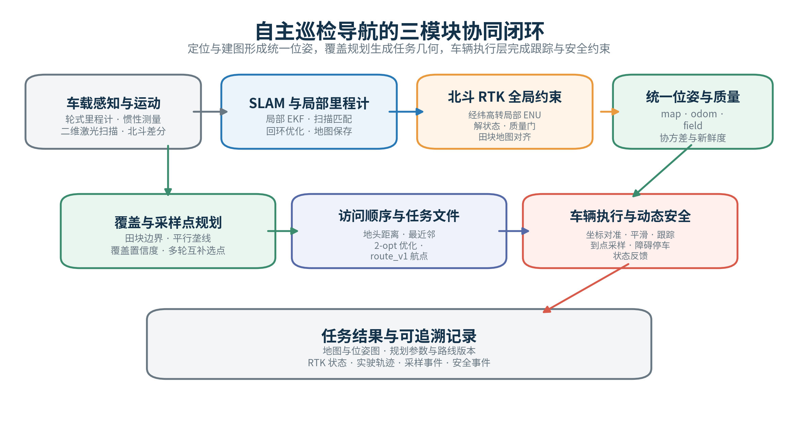

*图 N-1 自主巡检导航的定位规划与车辆执行架构*

## 系统组成与分层坐标

移动平台采用 WHEELTEC R550 PLUS 四轮底盘，外形尺寸约为 464.7 毫米乘 384.9 毫米乘 218 毫米，轴距约 312.7 毫米，轮距约 335.6 毫米，轮径约 152 毫米。底盘控制器和 STM32F407 下位机完成电机闭环、编码器采集和基础状态反馈，树莓派 5 运行 ROS 2 上层软件。感知与定位设备包括 ICM20948 惯性测量单元、YDLIDAR X3 Pro 二维激光雷达和 K988 北斗 RTK 接收机。

| 层级 | 主要构成 | 技术职责 | 工程意义 |
|---|---|---|---|
| 车辆执行层 | 四轮底盘 电机控制器 编码器 急停装置 | 完成速度闭环 里程估计和安全停车 | 与具体规划算法解耦 便于更换底盘 |
| 边缘计算层 | 树莓派 5 与 ROS 2 | 运行定位 建图 规划和任务状态机 | 算法在车端闭环运行 降低网络依赖 |
| 局部感知层 | 激光雷达 惯性测量单元 编码器 | 获取环境轮廓 车辆运动和障碍距离 | 支撑连续定位和近场安全 |
| 全局定位层 | 北斗 RTK 与差分数据链 | 提供全局坐标 解状态和定位质量 | 支撑跨日期和跨车辆任务复用 |
| 作业规划层 | 覆盖规划 采样点选择 路径跟踪 | 生成路线并控制车辆到点采样 | 将农艺要求转化为标准任务 |

系统使用田块坐标、地图坐标、局部里程坐标和车体坐标组织定位关系。田块坐标以现场参考点为原点，保存田块边界、采样点和规划路线；地图坐标由 SLAM 维护，描述激光雷达观测到的垄体、地头和障碍物；局部里程坐标强调短时间连续性，用于车辆控制；车体坐标及各传感器坐标记录安装位置和朝向。

坐标变换由明确的模块分别维护。轮速与惯性融合模块负责局部里程到车体的连续关系，SLAM 负责地图到局部里程的校正，传感器外参在安装标定后固定。北斗 RTK 先转换为田块局部平面坐标，再由全局对齐层与地图建立关系。该设计避免多个模块同时修改同一坐标关系，从架构上降低位置跳变和调试复杂度。

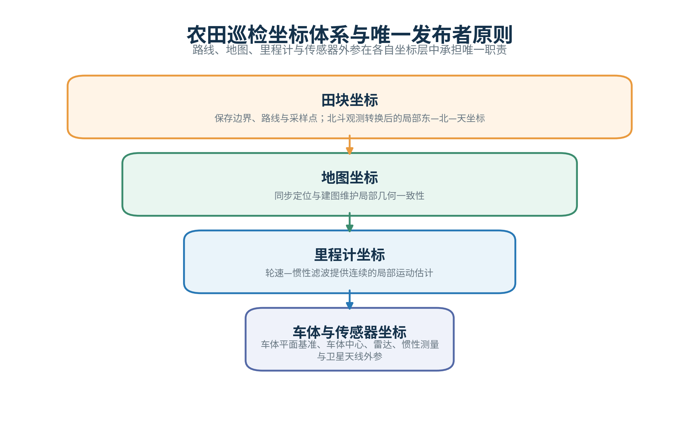

*图 N-2 田块地图局部里程与车体坐标的分层关系*

## SLAM 建图与局部连续定位

局部运动估计采用扩展卡尔曼滤波。编码器提供车辆前向速度和转动速度，惯性测量单元补充角速度与线加速度，滤波器综合两类观测的噪声特征，以约 20 赫兹输出连续里程。轮速信息在平稳行驶时具有较好短时一致性，惯性信息能够及时反映转向和扰动，两者融合后可减弱单一传感器的瞬时波动，并为激光扫描匹配提供合理初值。

二维激光 SLAM 以连续里程为运动先验，将当前扫描与局部地图进行匹配，获得车辆相对位姿和新的环境约束。当车辆位移或航向变化达到阈值时，系统生成关键帧并加入位姿图；检测到可信的重复区域后建立回环约束，再对整个位姿图进行优化。后端使用 Ceres 求解器、Levenberg Marquardt 迭代和 Huber 鲁棒损失，以降低局部误匹配对整体地图的影响。

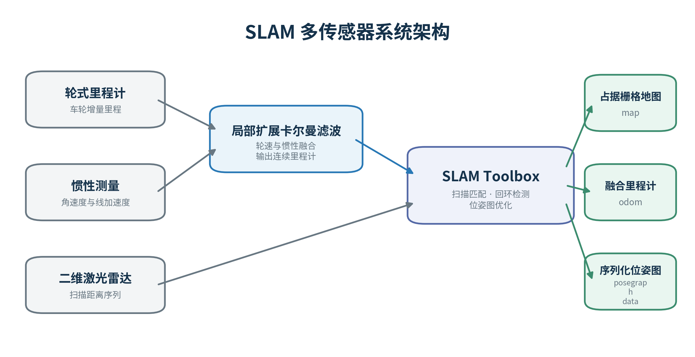

*图 N-3 轮速惯性测量与二维激光雷达的建图数据流*

现有参数将地图分辨率设置为每栅格 0.05 米，激光有效测距范围设置为 0.12 米至 8.00 米，扫描缓存保留 10 帧。车辆线位移超过 0.08 米或航向变化超过约 0.087 弧度时触发地图更新。这组参数在地图细节、计算量和低速车辆运动之间取得平衡：较高分辨率能够识别垄体边界，关键帧阈值则避免车辆静止或轻微振动时重复加入相似扫描。

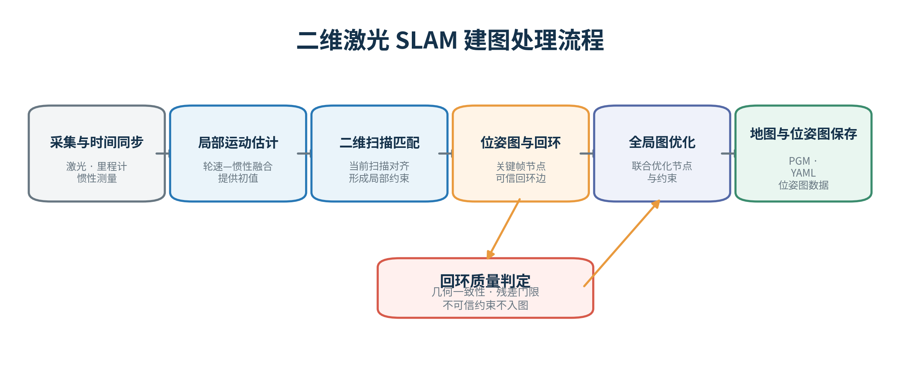

*图 N-4 二维激光 SLAM 的扫描匹配回环优化与地图保存流程*

地图采用占据栅格保存。占据区域对应作物垄、边界或障碍物，自由区域表示车辆可通行空间，未知区域表示尚未观测的位置。除用于界面显示的栅格地图外，系统同时保存地图元数据和序列化位姿图，便于后续继续建图、重新定位和参数复查。企业部署时可在首次进入田块时建立基础地图，在种植结构明显变化后更新地图版本。

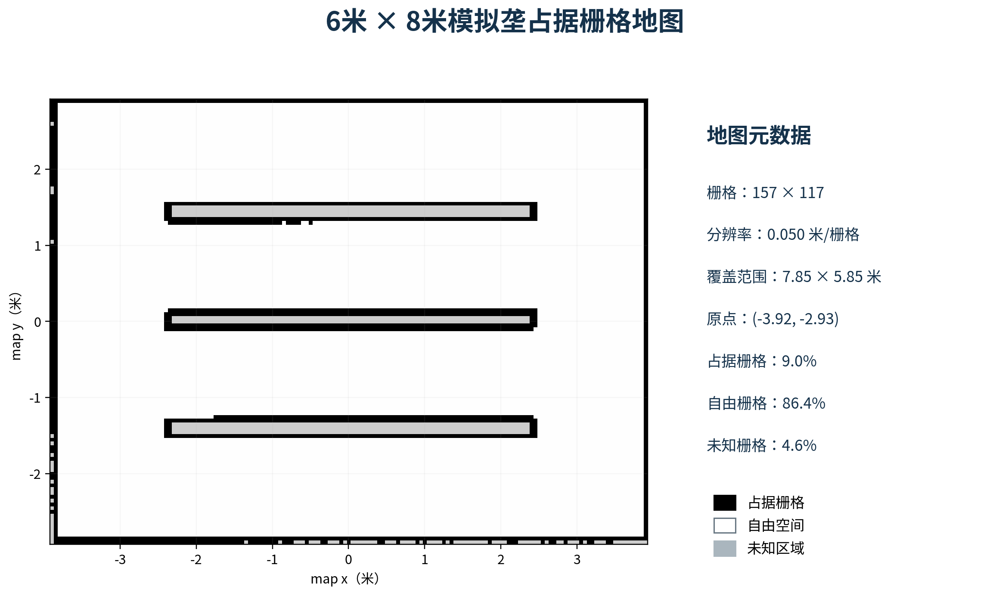

*图 N-5 六米乘八米模拟农田的占据栅格地图和地图参数*

## 北斗 RTK 全局约束与地图对齐

北斗 RTK 移动站通过网络差分服务接收校正数据，定位接收机据此计算车辆经纬度、高程、速度和差分解状态。系统同时记录卫星数量、定位协方差、差分数据龄期和时间戳，使定位模块能够判断当前观测的质量，而非仅使用一组位置数值。

全球经纬度首先转换到地心地固坐标，再以田块参考点转换为东向、北向和天向的局部平面坐标。卫星天线通常不与车辆几何中心重合，因此需要测量天线相位中心相对车体的杆臂偏移。完成外参补偿后，转弯过程中的天线运动才不会被误认为车体中心发生额外平移。

田块坐标与 SLAM 地图坐标之间采用二维刚体变换。系统在积累一组时间对应的北斗位置和地图位置后，估计平面旋转角和平移量，并通过鲁棒方法削弱异常点影响。该变换把按地理坐标规划的路线准确投影到车辆当前地图中，也是同一地块路线跨日期复用的基础。

\[
\begin{bmatrix}x_m\\y_m\end{bmatrix}=R(\theta)\begin{bmatrix}x_f\\y_f\end{bmatrix}+\begin{bmatrix}t_x\\t_y\end{bmatrix}
\]

北斗观测进入全局定位前需要通过质量判断。差分固定解、协方差和数据龄期均处于正常范围时，观测作为较强全局约束；浮点解降低权重并限制单次校正幅度；单点解、过期数据或明显跳变不用于地图校正。北斗短时受遮挡时，车辆仍可依靠局部里程和 SLAM 低速行驶；当北斗和地图定位质量同时下降时，任务状态机执行降速、暂停或人工接管。

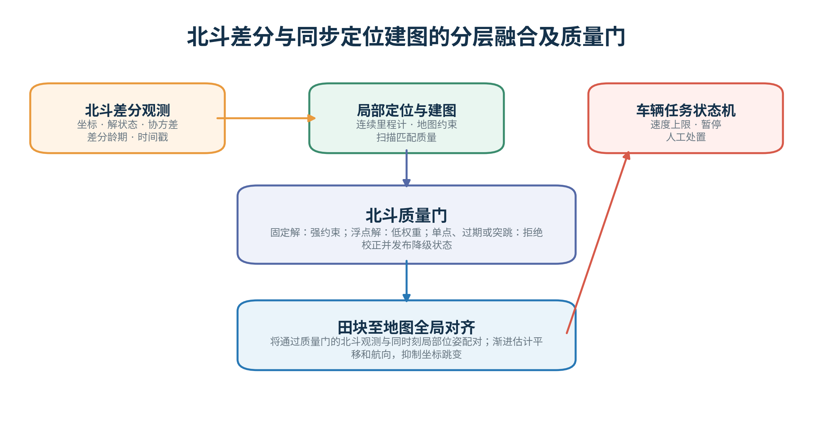

*图 N-6 北斗定位质量判断与田块地图全局对齐方法*

## 覆盖路径与采样点规划

规划模块的输入包括闭合田块边界、首条参考垄线、垄距、地头宽度、每轮采样数量、采样影响半径和车辆最小转弯半径。系统根据参考垄线确定主作业方向，在田块多边形内生成等距平行候选线，并裁剪超出边界或无法通行的线段。与依赖完整图像语义识别的方式相比，这种半自动标定方法对光照、作物生育期和底图质量的依赖较低，更适合企业在不同地块快速配置。

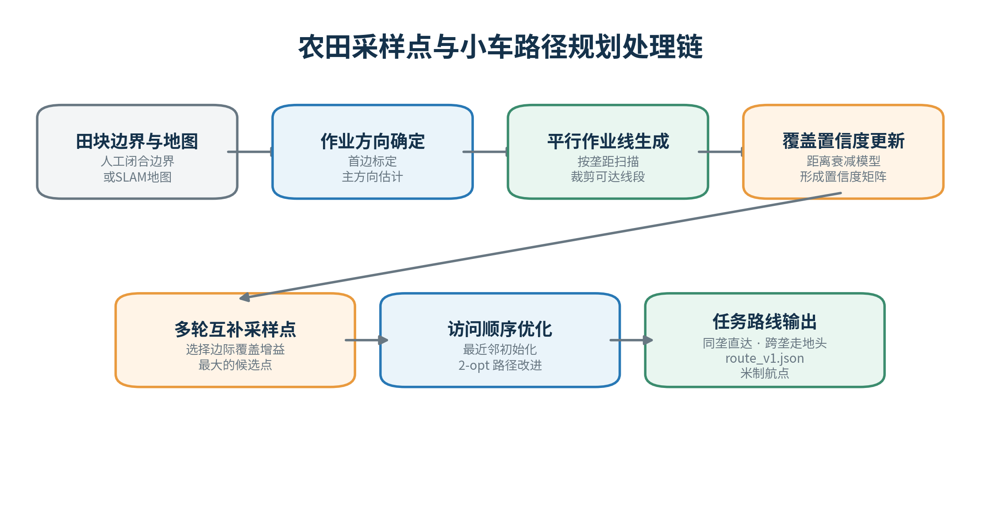

*图 N-7 从田块边界作业线到采样路线的规划过程*

采样点选择采用有限支撑的距离衰减模型。候选点 q 对评价位置 g 的覆盖置信度随距离平方衰减，距离超过影响半径 R 后贡献为零；多个已选点对同一位置的覆盖取最大值。算法每次选择能够带来最大边际覆盖增益的候选点，并在后续轮次继承已有覆盖结果，使新增点优先补充低覆盖区域。

\[
c_q(g)=\max\left(0,1-\frac{d(q,g)^2}{R^2}\right),\qquad C_S(g)=\max_{q\in S}c_q(g)
\]

该模型把采样数量、空间影响范围和目标覆盖水平转化为可调整参数。企业可以根据检测成本、作物类型和病害传播尺度设定影响半径与轮次，也可以采用不同阈值统计重点覆盖率和几何覆盖率。规划结果因而既适用于一次性普查，也适用于首轮筛查后的定向复检。

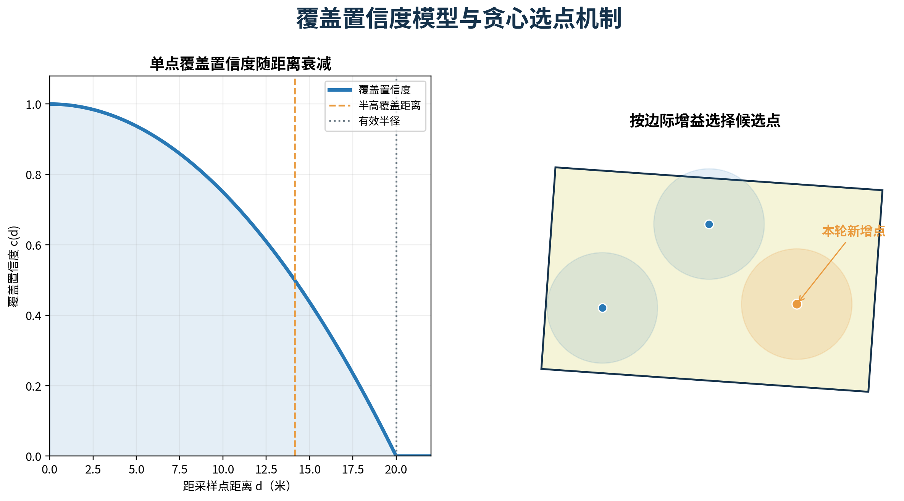

*图 N-8 单点覆盖衰减与边际增益选点机制*

采样点确定后，系统将各点匹配到最近的可行垄线，在同一垄内按纵向位置排序。跨垄移动优先通过地头连接，避免车辆直接穿越作物垄。访问顺序先使用最近邻方法快速生成初始解，再采用二边交换优化降低总路程。路线经过曲线平滑和等弧长重采样后，形成连续参考轨迹，并为每个采样点附加期望航向、速度上限、到达容差和驻留时间。

在 8220.31 平方米的规划案例中，田块包含 22 条作物垄，垄距为 4.0 米，采样影响半径为 20 米。系统安排两轮采样，每轮选择 8 个点。第一轮路线为 491.18 米，第二轮路线为 589.96 米，总路程为 1081.14 米；按每秒 0.5 米的名义速度估算，纯行驶时间约 36 分钟。两轮累计半高覆盖率达到 88.37%，影响半径内的几何覆盖率达到 99.56%。

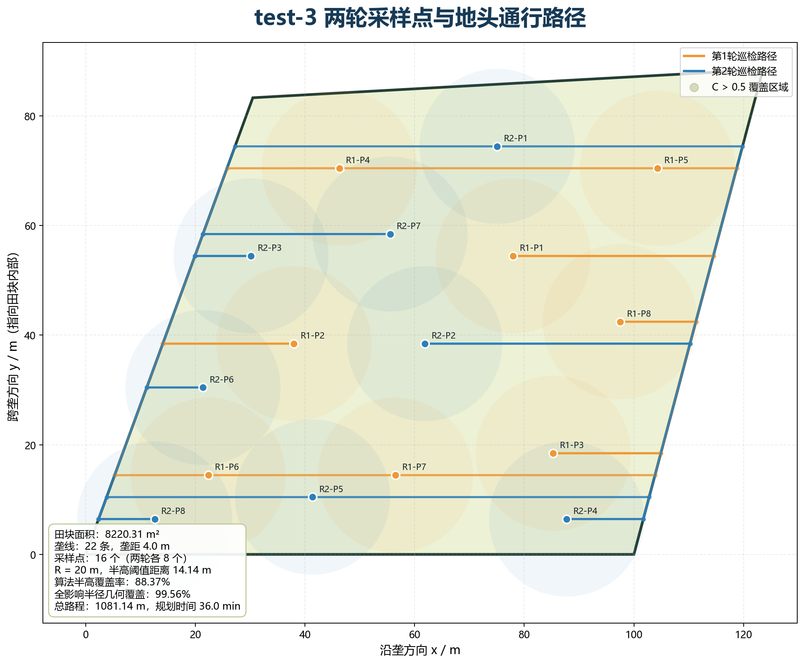

*图 N-9 中等规模田块的两轮采样点布局与地头通行路线*

| 规划指标 | 参数或结果 | 技术含义 |
|---|---:|---|
| 田块面积 | 8220.31 平方米 | 检验中等规模田块的规划计算 |
| 作物垄结构 | 22 条 垄距 4.0 米 | 路线生成遵循垄作结构 |
| 采样配置 | 两轮各 8 个点 | 支持筛查与复检分轮执行 |
| 累计半高覆盖率 | 88.37% | 评价高贡献区域的覆盖程度 |
| 几何覆盖率 | 99.56% | 评价田块是否进入采样影响范围 |
| 规划总路程 | 1081.14 米 | 支撑作业时间和电量估算 |

## 车辆执行与安全控制

规划结果以标准任务数据传递给车辆，内容包括田块坐标、路线版本、航点顺序、速度约束和采样身份。车辆根据田块与地图的对齐关系转换航点，检查路线是否位于可通行区域，再执行平滑和重采样。路径跟踪采用 Pure Pursuit 前视跟踪方法，通过车辆坐标系中前视点的横向偏差计算目标曲率，并由当前速度得到转向角速度。该方法计算量小，适合低速差速或四轮移动平台实时运行。

当前控制参数将最大线速度设置为每秒 0.12 米，最大角速度设置为每秒 0.30 弧度，前视距离为 0.5 米，最小转弯半径为 0.5 米。较低速度用于减小狭窄垄间的横向偏差，也为激光障碍判断和采样驻留预留响应时间。实际部署时，可根据通道宽度、负载、地面附着条件和定位协方差动态调整速度上限。

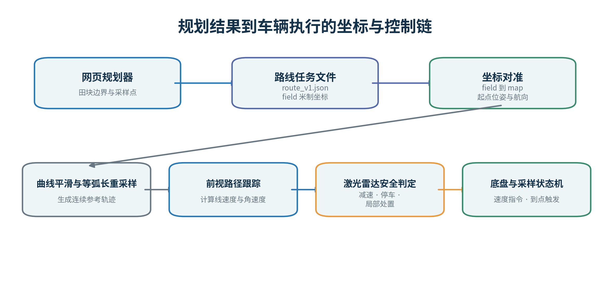

*图 N-10 规划路线经过坐标对准和平滑后进入车辆控制的过程*

任务状态机按照载入任务、开始导航、到达航点、车辆稳定、触发采样、完成驻留和继续行驶的顺序推进。每个事件保存任务编号、采样编号、位置、时间和定位质量，便于控制台显示进度，也便于后续把样本检测结果与采样位置对应。采样装置可通过标准触发接口接入，替换采样器不会改变路线跟踪和定位逻辑。

车端安全节点独立于电脑和手机运行。激光雷达在车辆前方正负 90 度范围内检查障碍，默认停车距离为 0.5 米；激光或位姿数据超过约 0.5 秒未更新时，系统停止使用陈旧信息并输出零速度。上层速度限制、通信看门狗、底盘保护和现场物理急停构成多层防护，网络中断不会使车辆失去本地停车能力。

## 可行性验证与结果分析

SLAM 部分在 8 米乘 6 米模拟农田中完成两轮独立建图。地图分辨率为每栅格 0.05 米，覆盖范围为 7.85 米乘 5.85 米，三条模拟垄在两轮地图中的中心偏移均为 0.05 米。占据区域、自由区域和未知区域的比例与场景结构相符，说明扫描匹配、地图保存和重复性评价流程可以稳定运行。

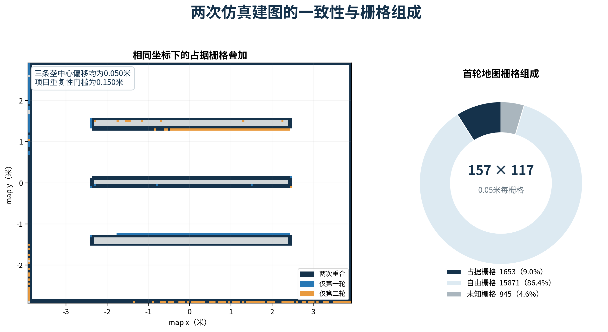

*图 N-11 两次模拟建图的栅格叠加与地图组成*

北斗融合测试选取 63.8 秒的差分固定解区间，将局部融合轨迹与北斗局部平面轨迹进行时间对应和二维刚体对齐。平均位置差为 0.044 米，均方根差为 0.049 米，95% 分位差为 0.082 米，最大差为 0.117 米。结果表明坐标转换、时间同步和全局对齐方法具有良好一致性，可为 0.5 米以内的总体定位目标提供稳定约束。

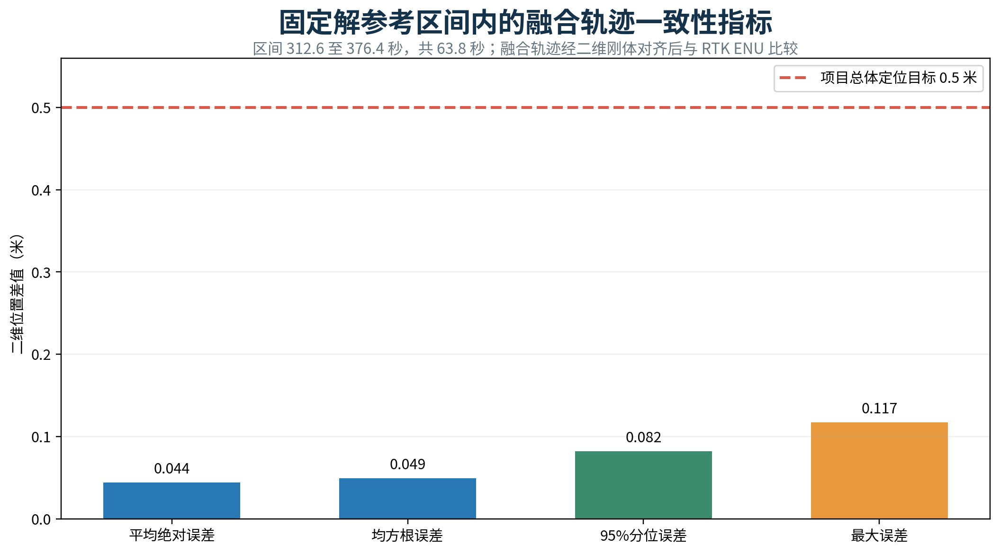

*图 N-12 差分固定解区间内的局部融合轨迹与北斗轨迹对比*

车辆执行部分完成直线、方形回环、双垄往复、多点采样和静态障碍停车等 9 次小尺度试验。3 米直线路线终点差约 0.08 米，方形回环闭合差约 0.22 米，双垄往复终点差约 0.18 米；多点任务能够依次完成航点到达、稳定驻留、采样触发和任务结束。测试覆盖了规划解析、路径跟踪、转弯、采样状态和障碍停车等关键环节。

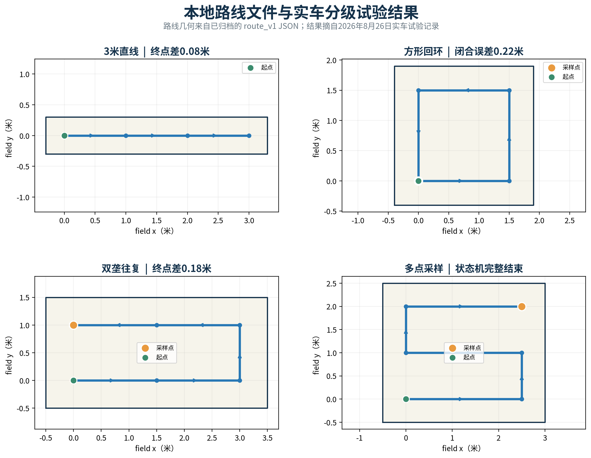

*图 N-13 代表性路线结构与小尺度实车任务结果*

上述实验分别验证地图构建、全局对齐、规模化规划和车辆执行。项目下一阶段可在代表性真实垄作场景中完成整幅地图保存，并使用同一田块、同一坐标和同一任务记录开展连续作业评价，使各项模块验证进一步汇合为完整田间任务结果。

## 工程实施与技术创新

方案实施可分为现场测绘与安装标定、基础地图建立、北斗与地图对齐、标准路线试运行和连续作业评价五个环节。安装阶段确定雷达、惯性测量单元和卫星天线相对车体的位置；建图阶段固化地图分辨率、扫描范围和低速行驶参数；对齐阶段建立田块参考点并检查差分定位质量；试运行阶段验证路线、地头转弯和采样驻留；连续作业阶段形成不同作物、通道和速度条件下的参数模板。

本方案的技术创新体现在三个方面。分层定位将局部连续性、环境几何和全局坐标分别处理，并通过定位质量控制校正强度；覆盖规划把连续空间置信度、多轮互补选点和垄作通行规则纳入同一算法；标准任务数据将路线约束、采样身份和车辆状态联系起来，使规划、控制和业务系统能够分别迭代。以上设计建立在成熟硬件和 ROS 2 软件基础上，具有明确的工程实现路径。

# 二 统一总控制台与电脑手机双端控制方案

## 产品定位与使用角色

病害巡检涉及地块、机器人、环境、采样、PCR 检测、病害识别、风险预测和处置记录。若这些信息分别保存在地图软件、设备调试界面和数据分析程序中，任务编号、采样位置与检测结果容易失去对应关系，也会增加现场人员和管理人员之间的沟通成本。

统一总控制台面向规划研判和现场作业两类场景。电脑端承担地块建档、路线规划、参数配置、批量分析和报告输出；手机端承担连接状态、任务进度、关键告警和风险摘要查看，并提供暂停、返航、取消等受限操作。两个终端共享业务逻辑和数据定义，界面根据屏幕尺寸和人员职责调整信息密度。

## 一核多端技术架构

控制台采用一套业务核心支撑多种终端。表现与封装层使用 Next.js、React 和响应式样式构建 Web 界面，并通过 Electron 封装桌面应用、通过 Capacitor 封装 Android 应用。业务层包含路径规划、环境监测、PCR 分析、病害识别、趋势预警、监管告警和机器人监控七类功能。数据层统一路线、任务、车辆状态、样本、预测和告警的字段含义。设备接入层连接模拟数据、历史回放和车辆实时数据。通用服务层为账户、文件、数据库和审计能力保留接口。

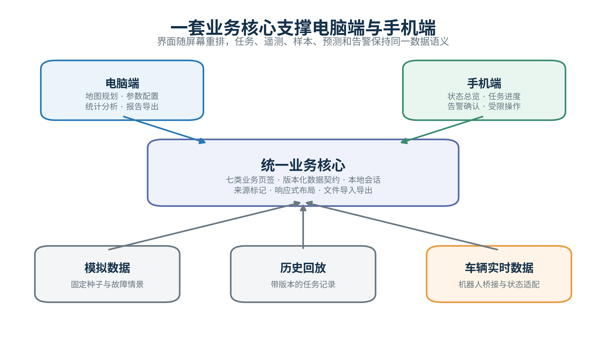

*图 C-1 统一业务核心与电脑手机多终端架构*

这种架构将终端差异限制在界面布局和授权操作范围内。路径规划方法、风险计算、任务状态和样本数据只维护一份，桌面端与移动端读取相同结果。企业新增页面或调整业务规则时，可在公共业务层完成修改，再由各终端使用，减少双端独立开发造成的版本偏差。

| 技术层 | 主要实现 | 设计作用 |
|---|---|---|
| 表现与封装层 | React 响应式界面 Electron 桌面封装 Capacitor 移动封装 | 适配宽屏和移动屏幕并形成可安装应用 |
| 业务层 | 规划 监测 检测 识别 预警 告警 机器人七类页面 | 组织病害巡检主要业务 |
| 数据契约层 | 任务 遥测 样本 预测 告警统一定义 | 保证跨终端和跨模块语义一致 |
| 设备接入层 | 模拟数据 历史回放 机器人实时桥接 | 隔离设备和通信方式差异 |
| 通用服务层 | 会话 文件导入导出 账户 数据库 审计扩展 | 支撑从单机演示到企业部署 |

## 电脑端和移动端交互

电脑端采用参数面板、地图工作区和统计区域组合布局。规划人员可以导入底图或 SLAM 地图、绘制田块边界、设置垄距和采样参数，并在导出任务前检查路线长度、覆盖率和采样点分布。PCR 与趋势页面适合展示批量数据、空间热力图和多模型比较，监管页面汇总告警状态和处置记录。

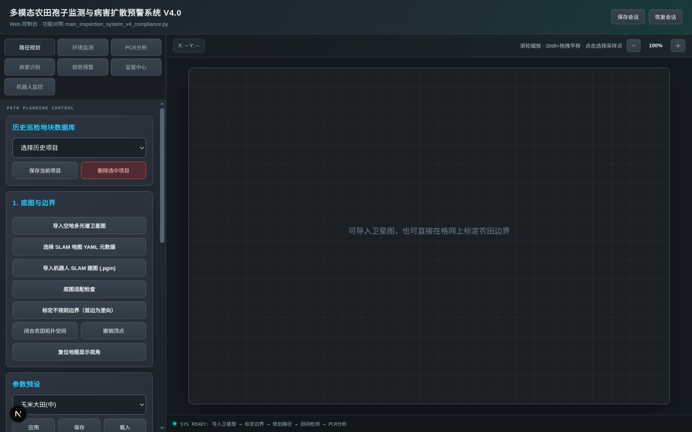

*图 C-2 电脑端的田块边界配置与路径规划界面*

移动端以现场快速查看和低频操作为重点。首页优先展示车辆连接、任务进度、电量、环境摘要、PCR 风险和告警数量，地图区域显示当前位置与任务范围。窄屏布局将多列卡片重排为双列或单列，页签可横向滚动，关键操作使用较大的触控区域。暂停、返航和取消需要再次确认，连续速度控制默认不在手机端开放，以降低户外误触风险。

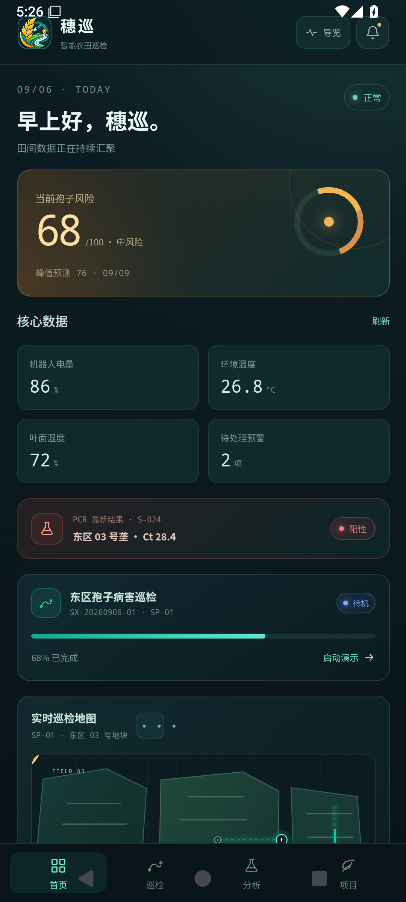

*图 C-3 手机端的任务状态环境信息和风险摘要界面*

响应式规则覆盖桌面宽屏和常见手机尺寸。界面在 900 像素、680 像素和 520 像素附近切换布局，地图和表格保留滚动能力，按钮不会因屏幕变窄而相互遮挡。电脑端和手机端显示同一任务编号、当前航点、进度和更新时间，避免操作人员因终端差异获得不同结论。

## 统一数据模型与业务追溯

控制台以田块、任务、样本和设备为核心对象。田块对象保存边界、地图版本和作物信息；任务对象保存路线、规划参数、执行状态和当前航点；样本对象保存采样位置、采样时间、PCR 结果和质量标记；设备对象保存车辆位置、电量、定位质量、故障和连接状态。预测和告警通过任务编号与样本编号关联，从而形成从路线规划到采样、检测和风险处置的完整记录。

系统在数据进入业务层前检查坐标系、单位、时间戳、版本和状态枚举。未知版本或错误单位不会直接进入计算，缺少关键字段的记录会被标记并等待补充。工作区支持保存和恢复，历史数据可以按版本迁移；密码、令牌和设备密钥与普通业务数据分离，避免随报告或任务文件导出。

模拟、回放和实时是三类明确的数据来源。模拟数据使用固定场景复现低电量、定位降级、障碍和采样失败等情况，适合培训和故障演练；历史回放按原始时间顺序重现已完成任务，适合问题分析；实时数据反映正在运行的车辆。界面保留来源标签和更新时间，技术人员可快速判断数据的时效性和来源。

## 车辆接入与状态同步

车辆通过 rosbridge WebSocket 将机器人中间件中的位置、激光障碍、电池、诊断和任务进度发送给控制台。接入适配层优先读取融合后的车辆位姿，同时保留原始里程和定位质量用于诊断；不同传感器和控制程序的原始状态在适配层转换为统一业务状态，页面无需识别底层通信名称。

每类实时数据设置独立的新鲜度阈值。位置和障碍数据需要较高更新频率，电池和环境数据可以较低频率更新。超过阈值后，界面将状态标记为过期或不可用，并停止沿用旧数值。任务事件使用编号和时间戳排序，网络恢复后按事件顺序补充，防止重复执行操作或以旧状态覆盖新状态。

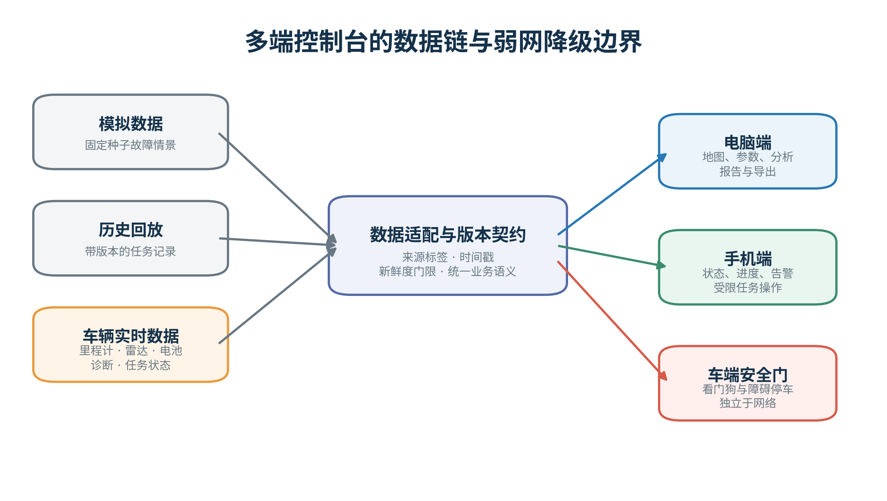

*图 C-4 模拟回放与车辆实时数据进入多端控制台的过程*

该适配方式为企业接入不同型号机器人提供了稳定边界。新车辆只需把自身位置、任务和诊断信息转换为控制台统一数据，无需重新开发规划、样本和预警页面。对于已经部署设备管理平台的企业，控制台也可通过标准接口上报任务摘要和告警记录。

## 弱网运行与安全控制

田间无线通信受距离、作物遮挡和基站条件影响，双端控制不能把实时安全依赖于网络。控制台负责下发任务、显示状态和记录操作，路径跟踪、障碍停车和通信看门狗保留在车辆端。手机退出、电脑休眠或网络中断后，车辆仍依据本地定位、障碍和任务状态执行减速或停车。

网络中断时，界面锁定新的运动操作并保留最近一次地图和任务摘要。连接恢复后，系统首先重新确认车辆身份、任务编号和当前状态，再开放允许的操作。若车辆仍在执行任务，控制台只同步进度，不重复发送已经确认的命令。这一机制兼顾现场可用性和命令一致性。

系统设置观察员、农技人员、任务管理员、现场安全员和系统管理员五类角色。查看历史、确认检测、创建路线、授权运动和维护账户分别由相应角色承担。高风险操作依次经过身份认证、角色授权、再次确认和事件记录，手机端默认不开放连续速度控制。车辆停车能力由车端看门狗、障碍判断、速度限制、物理急停和断电共同保证。

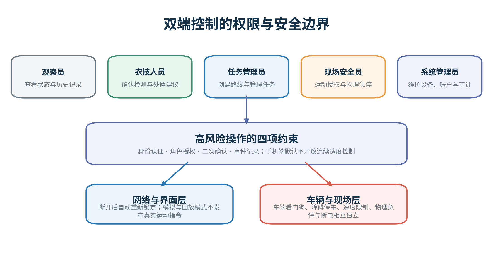

*图 C-5 多角色权限管理与车端独立安全控制*

桌面封装启用进程隔离、渲染沙箱和网络访问限制，降低网页内容直接调用本机能力的风险；Android 应用按最小权限配置。规模化部署时，可增加 HTTPS、设备证书、账户审计和远程升级签名，使终端安全与企业现有信息安全制度衔接。

## 多端封装与部署方式

项目已生成 Windows 标准安装程序、Windows 便携版本和 Android 安装包，并完成桌面宽屏、360 乘 800、393 乘 873 和 412 乘 915 等视口检查。Android 版本在模拟器中完成安装、启动、自动导览和重置验证。上述工作说明同一业务核心能够稳定封装为电脑端和移动端应用。

| 终端 | 主要使用者 | 主要功能 | 安全职责 |
|---|---|---|---|
| 电脑端 | 规划人员 技术管理人员 | 地块建档 路线规划 参数配置 分析与报告 | 管理任务和权限 不承担底盘实时闭环 |
| 手机端 | 现场人员 农技人员 | 状态查看 进度跟踪 告警确认 受限任务操作 | 运动相关操作需要状态确认 |
| 车辆端 | 机器人控制系统 | 定位 跟踪 采样状态 障碍停车 | 独立完成实时控制和安全停车 |

企业可按单机离线、农场局域网或集中服务三种模式部署。单地块试点只需电脑端、手机端和车辆边缘计算单元；多地块应用可增加 PostgreSQL 与 PostGIS 数据库、文件存储和审计服务；跨区域运营可进一步接入云端设备管理和远程升级。由于业务层和数据模型保持一致，部署规模变化不需要重写终端功能。

## 技术特点与应用价值

一核多端架构减少电脑端和手机端的重复开发，统一数据模型解决任务、样本、检测和告警之间的关联问题，设备适配层降低不同机器人接入成本。弱网降级与车端安全分层则符合农业现场网络不稳定、设备必须独立停车的运行条件。

现有七类业务页面、响应式布局、多端封装、工作区保存、历史回放和车辆数据接入已经覆盖主要工程环节。企业可先将控制台用于单车规划和现场监管，再逐步扩展账户体系、数据库、设备证书和多车辆调度。该实施方式能够保留现有软件成果，并把后续投入集中在企业数据治理和规模化运维上。

# 三 PCR 观测驱动的孢子扩散预测预警方案

## 业务需求与模型框架

空气孢子采样和 PCR 检测能够在肉眼症状出现前发现病原信号，但单个检测结果只对应有限位置和时间。企业需要进一步判断潜在风险区域、传播方向、未来几天的暴露水平以及复检和防控顺序。模型因此既要利用 PCR 的特异性，也要考虑天气和冠层对孢子传播的影响。

本方案由观测融合、疑似源反演、动态传播、孢子命运和侵染窗口五部分组成。粗测数据提供较密集的空间趋势，PCR 结果校正关键位置；疑似源反演估计可能的源位置和相对强度；动态模型根据逐时风场计算输送和扩散，并加入紫外失活、重力沉降、降雨清除和再释放；侵染窗口将孢子暴露与温湿度条件结合，输出三天、五天和七天风险。

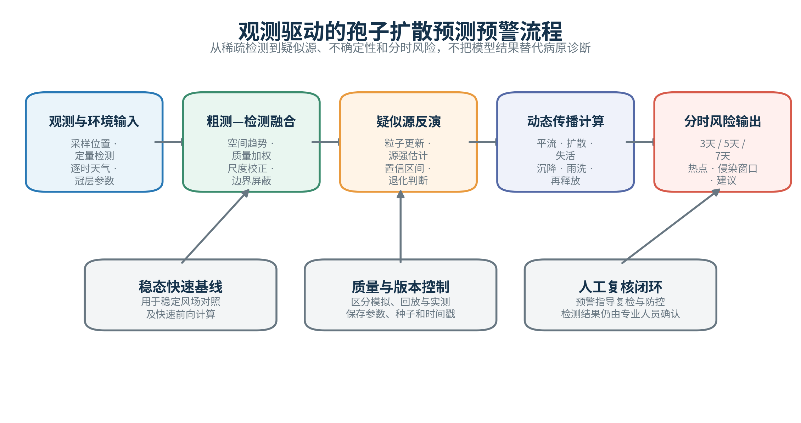

*图 A-1 从采样观测到疑似源动态传播和分时风险的计算流程*

## 数据输入与质量控制

模型输入包括田块边界、采样坐标、采样时间、粗测结果、PCR 定量结果、样本质量、逐时风速和风向、温度、湿度、光照、降雨、叶面积指数、株高、病情指数和目标病害参数。输出包括融合浓度场、疑似源位置、相对源强、不确定范围、三天五天七天浓度网格、热点面积、侵染风险和复检建议。

数据进入模型前进行完整性、质量和单位检查。采样位置必须位于田块边界内，时间与天气序列需要对应，PCR 结果需要带有检测状态和质量标记。有效结果按检测精度设置观测方差，存疑结果降低权重，无效或缺失结果不参与反演。每次计算保存输入版本、参数版本和生成时间，使风险图能够追溯到对应数据和模型配置。

PCR 结果转换为空气等效浓度时，需要综合采样体积、洗脱体积、稀释倍数、捕获效率和提取回收率。方案将这些因素设计为可配置标定参数。在企业完成采样装置和检测流程标定前，模型可使用相对浓度比较空间差异；标定后只需替换尺度参数，传播和风险计算结构保持不变。

## 稳态基线与模型选择

高斯烟羽模型把稳定风场中的连续释放表示为横向和垂向高斯分布。模型计算速度快、参数含义清晰，适合风向稳定、源位置相对明确的快速估计，也可在疑似源反演中反复计算候选源对观测点的影响。

\[
C(x,y,z)=\frac{Q}{2\pi u\sigma_y\sigma_z}
\exp\left(-\frac{y^2}{2\sigma_y^2}\right)
\left[\exp\left(-\frac{(z-H)^2}{2\sigma_z^2}\right)+
\exp\left(-\frac{(z+H)^2}{2\sigma_z^2}\right)\right]
\]

其中 Q 表示释放强度，u 表示平均风速，横向和垂向扩散尺度随下风距离和大气稳定度变化，H 表示有效释放高度。地面镜像项描述近地反射效应，沉降衰减可作为附加损失加入。模型输出传播主方向和稳态浓度梯度，适合快速计算与稳定场景对照。

真实农田中常出现风向转折、间歇释放、冠层减速和阵雨过程，因此方案保留高斯烟羽作为稳态基线，同时采用动态网格模型处理具有时间记忆的非稳态情景。系统可根据天气变化幅度、预测时长和计算资源选择模型，也可同时运行两类模型并比较结果差异。

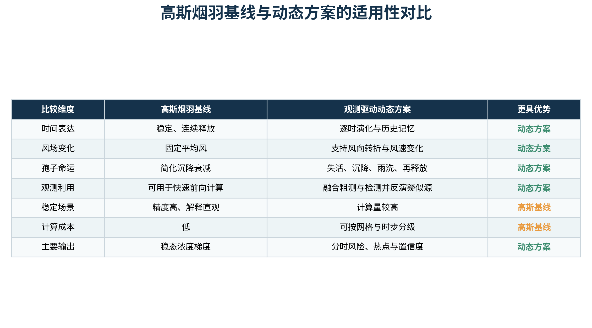

*图 A-2 高斯烟羽基线与观测驱动动态模型的适用场景*

## 粗测与 PCR 融合空间场

低成本粗测能够覆盖更多位置，但检测特异性和尺度稳定性有限；PCR 具有较高特异性，点位数量通常受检测成本和周转时间限制。方案先对粗测结果进行空间插值，形成连续趋势场，再利用 PCR 观测进行稳健尺度校正和局部残差修正。高质量 PCR 点获得较高权重，质量较低的点对结果影响相应减小。

融合后的空间场既保留粗测的覆盖范围，也吸收 PCR 对关键区域的定量约束，可作为动态传播的初始浓度场和疑似源反演的观测基础。田块外区域在计算中屏蔽，避免插值结果扩展到无实际意义的范围。点位增加后，模型重新计算局部残差，使风险图能够随检测数据持续更新。

该设计使企业能够采用分层检测策略。机器人先完成广覆盖筛查，PCR 资源集中用于高风险和高信息增益点位，后续采样再根据模型不确定性补充。与所有位置均进行高成本检测相比，分层观测更适合规模化田块的连续监测。

## 疑似源反演与不确定性

疑似源状态由平面位置和相对释放强度组成。系统在田块内部生成候选源粒子，使用快速前向模型计算每个候选源在现有 PCR 点位产生的预测浓度，再在对数空间比较预测值与观测值。对数表示能够处理跨数量级浓度，也更适合描述 PCR 定量结果的倍数误差。

每轮计算根据似然更新粒子权重，并统计有效粒子数量。权重集中表示现有观测对疑似源位置提供了较强约束，权重分散则对应较大的不确定范围。输出包括加权源位置、相对源强、协方差和不确定椭圆。点位较少或空间分布接近共线时，模型扩大不确定范围；新一轮采样加入后，后验分布重新更新。

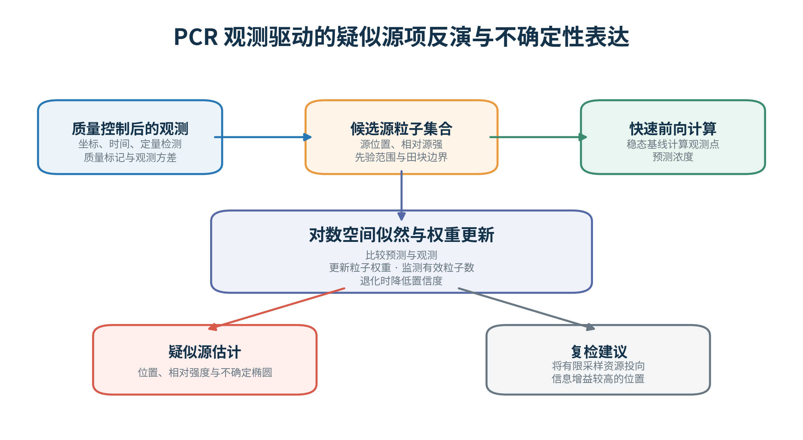

*图 A-3 PCR 观测驱动的疑似源估计权重更新与复检建议*

疑似源反演的直接业务价值是优化下一轮采样。系统可综合疑似源概率、当前覆盖程度和候选点信息增益，给出优先复检位置，使有限检测资源用于缩小不确定区域。输出作为风险研判和采样决策依据，与农技人员的病原学判断和田间调查共同使用。

## 动态平流扩散与孢子命运

动态模型采用逐时二维 Eulerian 网格。每个网格保存当前孢子浓度，风场驱动浓度沿主方向输送，湍流扩散使浓度向周围网格展开，源项表示感染区或病斑释放，紫外失活、重力沉降和降雨清除构成损失，再释放项描述沉积孢子重新进入空气。

\[
\frac{\partial C}{\partial t}+\mathbf{u}\cdot\nabla C
=\nabla\cdot(K\nabla C)+S-
(\lambda_{uv}+\lambda_{dep}+\lambda_{rain})C+R
\]

式中 C 为孢子浓度，u 为近冠层有效风矢量，K 为湍流扩散系数，S 为源项，三个损失系数分别对应紫外、沉降和降雨，R 为再释放。叶面积指数和株高用于修正近冠层风速，避免直接使用气象站高度的风速代表作物冠层内部输送。

每个时间步先读取并插值逐时天气，再计算冠层风场、平流输送、邻域扩散、命运损失和再释放，随后执行非负性检查和田块边界屏蔽。阵雨只在实际发生时段施加清除作用，风向改变后新的输送方向会与前一时刻浓度共同决定下一时刻分布。该计算顺序使模型能够保留历史天气造成的空间记忆。

交互端使用较粗网格快速生成风险图，离线分析端可使用较细网格开展参数标定和批量对照。两端共享天气、田块、病害参数和输出指标定义，并使用固定场景比较峰值、均值、热点面积和空间误差。企业可在边缘设备上运行快速版本，在服务器端运行高分辨率版本。

## 侵染窗口与分时风险

空气中存在孢子并不等同于作物一定发生侵染。病原、宿主和环境需要在一定时间内同时满足条件。方案为目标病害配置适宜温度、相对湿度、叶面湿润时长和潜育期参数，并将预测期内的孢子暴露量与侵染窗口共同转换为风险概率。

\[
P_{inf}=I_{window}\left(1-\exp(-D/D_0)\right)
\]

其中 I 表示环境条件是否形成侵染窗口，D 表示预测期内累计孢子剂量，D0 为病害相关响应尺度。环境不适宜时，较高空气浓度仍会得到较低侵染风险；温湿度和叶面湿润条件持续满足时，累计剂量增加会提高风险。该设计避免仅按单时刻浓度划分告警等级。

系统在 72 小时、120 小时和 168 小时形成三组输出，对应三天、五天和七天风险。每个时间节点包括浓度网格、侵染概率、热点范围、峰值、分位数、平均水平和置信度，并根据风险等级生成增加下风向采样、缩短复检周期或优先防控等建议。企业可根据作物价值、药剂成本和管理制度设置告警阈值。

## 模型可行性验证

为了验证动态表达在非稳态天气中的作用，项目设置稳定风场、风向转折以及风向变化伴随阵雨三类仿真情景。每个情景使用 20 个点进行浓度尺度校准，并以 60 个独立留出点比较预测结果。评价采用对数均方根误差和热点交并比，分别衡量浓度数量级误差和高风险区域重合程度。

稳定风场中，高斯烟羽模型的对数均方根误差为 0.437，动态方法为 0.720，说明稳态基线在其假设成立时具有较高效率和准确性。风向转折场景中，动态方法误差为 1.476，高斯烟羽为 3.497；风向变化伴随阵雨时，两者分别为 1.267 和 3.200。动态方法在后两类情景中的误差分别降低 57.8% 和 60.4%，验证了逐时风场和降雨过程的建模价值。

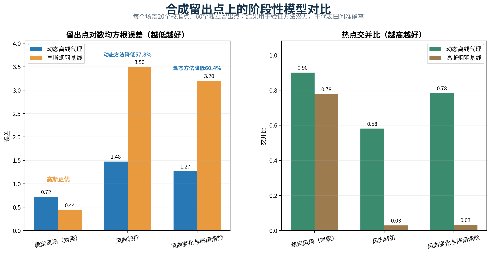

*图 A-4 稳定风场风向转折和阵雨情景下的模型表现*

轻量化数值基准进一步比较 72 小时、120 小时和 168 小时三个预测期。细网格数值场作为参考，动态扩散核心使用较粗网格重构传播结果，并在每个预测期使用 30 个固定随机点计算误差。动态方法的对数均方根误差分别为 0.6783、0.6787 和 0.6790，高斯烟羽分别为 0.9281、0.9410 和 0.9492，对应降低 26.9%、27.9% 和 28.5%。

动态方法在三个时段呈现约正 0.37 的稳定偏差，高斯烟羽呈现约负 0.73 至负 0.75 的偏差。报告同时保留均方根误差和偏差，是为了区分空间拟合能力与整体高估或低估趋势。稳定偏差可在企业试点数据积累后通过尺度标定和参数更新修正。

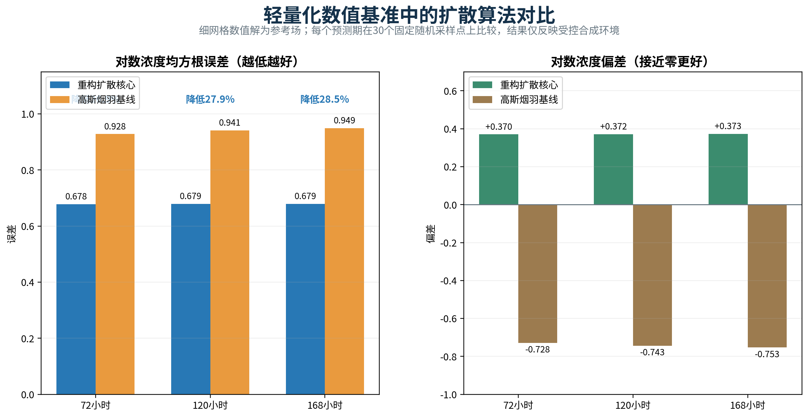

*图 A-5 三个预测期的动态扩散核心与高斯烟羽数值对比*

两组仿真结果分别回答模型选择和数值实现问题。天气情景对比说明稳定条件适合快速高斯模型，风向和降雨变化时应采用动态模型；多预测期基准说明粗网格动态计算能够连续保持主要传播特征。实验由此支撑混合模型架构和边缘端轻量化实现，而非替代企业现场的作物与病害参数标定。

## 工程部署与技术创新

预测引擎包含稳态传播、动态扩散、疑似源反演、侵染窗口和多时段风险输出，并配套自动测试和离线对照工具。工程部署可分为三个阶段。试点阶段选择单一作物和目标病害，标定采样体积、检测单位、天气数据和病害参数；推广阶段积累多轮采样、天气和处置结果，建立地区化参数；规模化阶段把模型版本、风险阈值、人工确认和效果评价纳入企业质量管理体系。

方案的创新性来自观测与机理的协同。PCR 观测用于修正空间趋势并反演疑似源，动态模型表达风向变化和孢子命运，侵染窗口把空气传播结果转化为农艺风险。模型同时输出不确定范围和复检位置，使预测结果能够参与下一轮数据采集。企业因此可以把有限检测资源集中到高风险和高信息增益区域，并保存从观测输入、模型计算到风险处置的完整过程。
