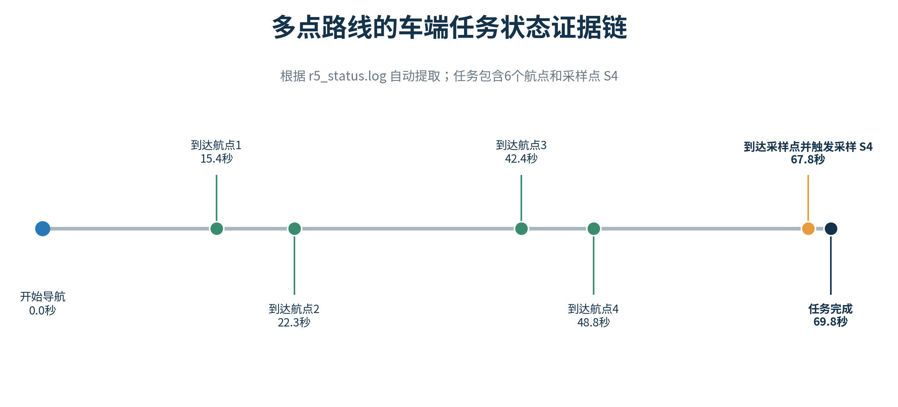

# 三模块技术方案整合初稿

> 项目：基于机器人与 DNA-PCR 技术的孢子病害识别关键技术研究  
> 版本：v6.0  
> 日期：2026-09-12  
> 整合说明：本版将北斗 RTK、SLAM 建图、路径与采样点规划三份成员初稿统一纳入自主巡检导航总方案；控制台和孢子扩散预测章节沿用原稿，保持独立。导航章节进一步使用项目已归档的路线 JSON、车辆任务日志、两次仿真地图和复算结果补强成果展示；阶段性数据不外推为未经独立真值验证的最终指标。

---

# 一、基于 SLAM、北斗 RTK 与覆盖路径规划的自主巡检导航方案

## 1.1 应用场景、总体目标与模块边界

规模化种植场景要求移动平台在较少人工干预条件下重复进入指定田块，沿作物垄完成巡检与定点采样，并将样本、位置、时间和后续检测结果建立可追溯关联。农田缺少稳定人工标志，地面起伏、作物遮挡、垄形重复、卫星信号变化与无线链路波动会同时作用于车辆定位。单独依赖轮速里程计会产生累积漂移，二维激光 SLAM 难以直接提供地理坐标，单一 GNSS 又难以兼顾遮挡环境下的连续性，因此需要把局部建图、全局约束、覆盖规划和车端安全组织为一套可实施方案。

本项目以 WHEELTEC R550 PLUS 四轮移动平台为载体，构建“SLAM 局部地图与连续里程计—北斗 RTK 全局约束—覆盖与采样点规划—车辆执行与安全控制”的自主巡检导航方案。三个技术模块由统一坐标、统一任务文件和统一质量状态衔接，但保持清晰职责：SLAM 负责局部几何与连续定位，RTK 负责田块地理坐标和长期漂移约束，规划模块负责把田块边界与采样要求转换为车辆可执行的米制路线。Web 控制台只承担任务交互、状态展示和记录管理，不进入定位闭环；孢子扩散算法使用带时空标签的采样结果，但不参与车辆导航计算。

方案面向竞赛“完整、创新、可行的企业级设计方案”要求，重点说明系统如何构成、为什么能够实施、现有成果验证到何种程度。项目将定位误差不大于 0.5 m 作为总体目标，但仅在具有独立真值和完整原始记录时才认定该指标已经通过。

*图 N-1 自主巡检导航的三模块协同闭环。图中给出三个技术模块的输入、输出和责任边界，属于依据现有软硬件实现整理的系统架构图。*

## 1.2 软硬件基础与统一坐标体系

车辆采用 WHEELTEC R550 PLUS 高配摆式悬挂四驱底盘，外形尺寸约为 464.7 mm×384.9 mm×218 mm，轴距 312.7 mm、轮距 335.6 mm、轮径 152 mm，配套 24 V、6000 mAh 电池。C50C 控制板及 STM32F407 下位机负责电机闭环、编码器采集和底盘状态反馈，树莓派 5 运行 ROS 2 Humble 上层软件。感知与定位设备包括底盘轮速编码器、ICM20948 IMU、YDLIDAR X3 Pro 二维激光雷达和成员测试采用的 K988 北斗 RTK 接收机。

| 层级 | 主要构成 | 当前用途 | 已有依据 |
|---|---|---|---|
| 车辆与执行 | R550 PLUS 四驱底盘、C50C/STM32F407 | 速度闭环、里程计、急停与状态反馈 | 实物参数、驱动配置和小尺度路线试验记录 |
| 边缘计算 | 树莓派 5、ROS 2 Humble | 定位、地图、规划、任务和安全节点 | 软件包、启动文件与参数配置 |
| 局部感知 | X3 Pro 激光雷达、ICM20948、编码器 | 扫描匹配、局部 EKF 和障碍检测 | 仿真建图、临时单垄实车地图和日志 |
| 全局定位 | K988 北斗 RTK、NTRIP/RTCM 差分链 | WGS84/ENU 坐标、解状态和全局约束 | 成员阶段测试图表；原始包与逐点数据待归档 |
| 任务执行 | 路线解析、Pure Pursuit、采样状态机 | 路线跟踪、到点驻留、采样和事件记录 | 代码、91 项路线测试和六类实车路线记录 |

*表 N-1 自主巡检导航的软硬件基础。*

系统采用 `field—map—odom—base_footprint—base_link—sensor_link` 分层坐标。`field` 是以现场参考点建立的东—北—天局部坐标，承载田块边界、规划路线和采样点；`map` 是 SLAM 建立的局部地图坐标；`odom` 保证短时间内的运动连续性；`base_footprint`、`base_link` 和各传感器坐标描述车辆与外参关系。

TF 遵循唯一发布者原则。现有轮速—IMU EKF 发布 `odom→base_footprint`，SLAM Toolbox 发布 `map→odom`，机器人模型发布车体到雷达、IMU 和 GNSS 天线的静态变换。RTK 不另行竞争发布 `map→odom`，而是先转换到 `field`，再由全局对齐层估计 `field→map` 或向统一全局状态估计器提供带协方差的观测。需要说明的是，项目当前部署的 `local_ekf.yaml` 只融合轮速与 IMU；RTK 在线进入全局估计器仍属于集成完善项，不能仅凭现有局部 EKF 配置表述为已完成在线三源融合。

*图 N-2 农田巡检坐标体系与唯一发布者原则。该关系避免多个节点同时修正同一 TF，并为 RTK 暂时降级时保留连续的局部运动估计。*

## 1.3 SLAM 建图与局部连续定位

### 1.3.1 多传感器链路与地图生成方法

局部定位首先由轮速—IMU EKF 提供。底盘编码器给出平面速度与角速度，IMU 提供角速度和线加速度，扩展卡尔曼滤波器以约 20 Hz 输出 `/odometry/filtered`。该位姿连续且延迟低，作为路径跟踪的主要局部状态；若融合位姿超过新鲜度门限，控制器只能在受控条件下回退，所有位姿均失效时立即输出零速度。

SLAM Toolbox 订阅 `/scan` 与局部里程计，通过扫描匹配建立局部约束，并利用位姿图和回环约束抑制长期变形。现有参数将地图分辨率设为 0.05 m/cell，激光有效范围设为 0.12～8.00 m，扫描缓存为 10 帧；线位移超过 0.08 m 或航向变化超过 0.087 rad 时触发更新。后端采用 Ceres、Levenberg–Marquardt 和 Huber 鲁棒损失求解位姿图。其职责是维护 `map` 中的环境几何并修正 `map→odom`，而不是替代高频局部 EKF。

*图 N-3 SLAM 多传感器架构。轮速与 IMU 形成局部连续里程计，二维激光扫描与 SLAM Toolbox 负责地图约束和回环优化。*

*图 N-4 二维 SLAM 建图处理流程。流程覆盖数据同步、扫描匹配、关键帧、回环检测、图优化以及 PGM/YAML 与位姿图保存。*

### 1.3.2 仿真结果、实车基础与证据边界

项目已在 8 m×6 m 的 Gazebo 模拟农田中完成 ROS 2 建图。场景包含三条模拟垄、1.20 m 净通道和 1.60 m 地头；车辆完成九航点闭环，并保存 PGM、YAML、pose graph 和 data 文件。标准地图为 157×117 个栅格，覆盖 7.85 m×5.85 m，分辨率 0.05 m/cell，其中占据、自由和未知栅格分别为 1653、15871 和 845。项目内复算工具已经重新验证上述文件尺寸和栅格统计。

两次同配置建图的三条垄覆盖率分别为 100%/100%/100% 与 100%/100%/99%，对应垄中心重复偏移均为 0.050 m，低于项目设定的 0.150 m 仿真重复性门槛。第一次建图三条垄的横向离散度为 0.018 m、0.003 m 和 0.030 m。另有 2026-09-01 临时单垄实车测试完成地图与位姿图保存，并记录 U 形掉头成功，说明从雷达数据到地图保存、再到车辆局部导航的基本链路能够在实车上运行。

*图 N-5 模拟垄占据栅格地图与参数。图中数据来自已保存的仿真地图和成员复核记录，地图文件及统计已由项目内工具复算。*

为验证同一参数和固定低速闭环下的地图一致性，项目对两次独立保存的占据栅格执行相同坐标叠加和垄中心比较。两轮地图的主要边界和三条模拟垄基本重合，差异主要分布在占据边缘；三条垄中心偏移均为 0.050 m。首轮地图共包含 18369 个栅格，其中占据栅格 1653 个、自由栅格 15871 个、未知栅格 845 个，占比分别为 9.0%、86.4% 和 4.6%。这些结果同时给出了地图完整性和重复性的量化依据。

*图 N-5A 两次仿真建图的一致性与栅格组成。左图直接叠加两次保存的 PGM 占据栅格，右图统计首轮地图栅格构成；偏移和覆盖结论由项目内地图比较工具复算。*

上述证据可以支撑 SLAM 参数、软件链路、地图保存格式和仿真重复性的可行性，但不能替代代表性真实农田的正式验收。目前尚缺的核心成果是：在与竞赛展示相符的真实垄作场景中完成建图并保存标准地图，同时留存同步 rosbag、场景尺寸、重复建图结果和可执行路线。这是导航部分提交前唯一尚未完成的主体实验，应在终稿中以正式实景地图替换临时单垄材料。

## 1.4 北斗 RTK 全局约束与 SLAM 对齐

### 1.4.1 差分链路与坐标转换

成员阶段方案采用 K988 北斗 RTK 移动站，通过 NTRIP 接收 CORS 差分数据并向接收机转发 RTCM。节点解析 NMEA/接收机数据后，输出 `/fix`、`/gps/status`、`/gps/raw_nmea`、`/gps/enu` 和 `/gps/velocity` 等信息。除经纬高外，系统还应持续记录 Fix、Float、Single 解状态、卫星数、协方差、差分龄期和时间戳，以便融合算法判断观测是否可用。

全球经纬度首先由 WGS84 转换到地心地固坐标，再以田块参考点转换为局部 ENU。天线相位中心到 `base_link` 的杆臂外参需现场测量并写入配置，避免转弯时把天线偏置误认为车体位移。`field` 与 `map` 的平面关系采用二维刚体变换表达：

\[
\begin{bmatrix}x_m\\y_m\end{bmatrix}=R(\theta)\begin{bmatrix}x_f\\y_f\end{bmatrix}+\begin{bmatrix}t_x\\t_y\end{bmatrix}
\]

在积累足够的 RTK—SLAM 同步位姿对后，可通过鲁棒估计求取航向和平移；更新采用平滑限幅，避免卫星解状态切换引起控制坐标瞬时跳变。

### 1.4.2 质量门、降级策略与阶段结果

RTK 观测进入全局约束前必须通过质量门。固定解且差分龄期、协方差和创新残差正常时作为强约束；浮点解降低权重并限制校正幅度；单点解、过期数据或空间突跳直接拒绝校正。RTK 暂时受遮挡时，车辆依靠轮速—IMU 与 SLAM 维持低速局部运动；若 RTK 与 SLAM 质量同时下降，则任务状态机降速、暂停并请求人工处置。

*图 N-6 北斗 RTK 融合质量门与全局对齐。质量门把解状态、协方差、数据新鲜度和创新残差共同纳入判定，保证全局校正可解释、可记录。*

成员提交的阶段记录选取 312.6～376.4 s、共 63.8 s 的 RTK Fixed 区间，以 RTK ENU 轨迹为内部参考，将局部融合轨迹执行二维刚体对齐后比较，得到平均绝对误差 0.044 m、均方根误差 0.049 m、95% 分位误差 0.082 m、最大误差 0.117 m，区间内误差不大于 0.5 m 的比例为 100%。该结果说明局部融合轨迹与 RTK 轨迹在所选固定解区间内具有较好一致性。

*图 N-7 固定解参考区间内的融合轨迹一致性指标。数据来自成员阶段记录；RTK ENU 在此作为内部比较参考而非独立真值，因此该图不能单独证明绝对定位精度。*

这一结果尚不能直接等同于“绝对定位误差 0.049 m”。原因是比较基准与待评估轨迹并非独立真值，且当前工作区未留存对应 rosbag、逐点误差表、分析脚本、卫星数、差分龄期和 Fix 比例。提交前应完成原始证据归档，并在条件允许时使用测量控制点、全站仪或另一套独立高精度轨迹计算 RMSE、P95 和最大误差。报告终稿可以据实陈述阶段一致性结果，同时把 0.5 m 作为由独立真值试验判定的系统目标。

## 1.5 覆盖路径与采样点规划

### 1.5.1 田块输入、覆盖置信度与多轮选点

规划模块以闭合田块边界、首条垄线、垄距、地头宽度、采样影响半径、每轮采样数量和车辆运动约束为输入。人工在地块图上标定首条垄线后，系统据此确定比例尺和垄向，在多边形边界内生成等距平行候选垄线；越界、自交、长度过短或地头空间不足的作业段在导出前被拒绝。该流程不依赖未经验证的图像语义分割，便于在不同地块快速配置。

*图 N-8 从田块边界到路线文件的规划流程。输入为可核验的边界和尺度信息，输出为带采样身份和车辆约束的米制任务文件。*

对候选采样点 q 与地块评价栅格 g，采用有限支撑的距离衰减置信度描述单点空间影响；多个已选点对同一栅格的覆盖取最大值：

\[
c_q(g)=\max\left(0,1-\frac{d(q,g)^2}{R^2}\right),\qquad C_S(g)=\max_{q\in S}c_q(g)
\]

算法逐次选择能够带来最大边际覆盖增益的候选点；下一轮在上一轮覆盖结果上继续优化，使采样点在空间上互补而非重复聚集。该设计把“采多少点、影响半径多大、要求达到何种覆盖水平”转换为可解释、可复算的规划参数。

*图 N-9 覆盖置信度与贪心选点机制。图示给出单点衰减、已选点最大覆盖和边际增益选点之间的关系。*

### 1.5.2 垄内访问、地头通行与 test-3 规划结果

采样点确定后，系统先把各点归属到对应垄线，在垄内按纵向位置排序；跨垄移动优先通过地头通行区连接，避免直接穿越作物垄。访问顺序以最近邻生成初始解，再使用 2-opt 降低总路程。规划结果分轮输出，各轮能够独立执行和追溯，也可按前一轮的完成情况重新规划后一轮。

成员提交的 test-3 规划案例采用 8220.31 m² 田块、22 条垄线、4.0 m 垄距和 R=20 m 的影响半径，每轮选择 8 个采样点，共两轮。第一、第二轮路线分别为 491.18 m 和 589.96 m，总路程 1081.14 m；按 0.5 m/s 名义速度估算，纯行驶时间约为 36.0 min。以 0.25 m 栅格独立评价，首轮与第二轮的半高覆盖率分别为 60.32% 和 52.10%，两轮累计半高覆盖率为 88.37%，全影响半径几何覆盖率为 99.56%。

*图 N-10 test-3 两轮采样点与地头通行路径。该图属于离线规划阶段结果，不表示车辆已经在同尺度真实田块完成 1081.14 m 实跑。*

| 指标 | test-3 结果 | 报告含义 |
|---|---:|---|
| 田块面积 | 8220.31 m² | 规划输入规模 |
| 垄线与垄距 | 22 条、4.0 m | 作业结构约束 |
| 两轮采样点 | 8+8 个 | 多轮互补配置 |
| 累计半高覆盖率 | 88.37% | 置信度阈值下的有效覆盖 |
| 全半径几何覆盖率 | 99.56% | 影响半径内的几何覆盖 |
| 总路程与名义时间 | 1081.14 m、36.0 min | 不含采样驻留和异常处置的规划估算 |

*表 N-2 test-3 离线规划案例的主要参数与结果。*

为保证该案例能够作为终稿可追溯证据，提交前还应归档原始田块边界、候选点、两轮选择结果、路线 JSON 和可一键复现上述指标的脚本。目前成员初稿中的图表与汇总数值可以用于说明算法方案和阶段结果，但不应替代原始输入输出文件。

### 1.5.3 路线任务文件与车辆执行

规划结果输出为版本化 `route_v1.json`，声明 `frame=field`、`coordinate_system=local_enu` 和 `unit=m`。每个任务包含 `field_id`、`route_id`、轮次、规划参数和航点序列；每个采样航点可携带 `sample_id`、期望航向、速度上限、到达容差和驻留时间。车辆载入路线后，以已估计的 `field→map` 变换转换航点，在 `map` 中进行合法性检查、平滑和约 0.1 m 等弧长重采样，再交由 Pure Pursuit 与任务状态机执行。

*图 N-11 从规划文件到车辆执行的接口链。规划只给出全局任务几何；临时障碍、数据过期和运动许可由车辆安全层实时处理。*

当前控制器默认最大线速度 0.12 m/s、最大角速度 0.30 rad/s、前视距离 0.5 m、最小转弯半径 0.5 m。项目已形成坐标转换、路径平滑、Pure Pursuit、采样状态机和路线 schema 代码；自动验证脚本重新运行后，91 项路线测试和 5 项 GNSS 解析测试全部通过。实车记录覆盖 1 m 直线、3 m 直线、方形回环、双垄往复、多点采样路线和静态障碍停车六类、共 9 次小尺度试验。这些成果证明规划输出能够进入现有车端执行链，但全尺度 test-3 路线尚未作为实车结果陈述。

项目本地归档的代表路线均采用 `route_v1` 数据结构，包含 `field` 坐标、田块边界、航点类型、速度上限、到达容差和采样身份。3 m 直线、方形回环、双垄往复和多点采样四条路线能够直接由当前解析器载入。路线图与实车试验结果并列展示，可以区分“规划任务几何”和“车辆执行结论”，避免把任务航点误当成实测轨迹。

*图 N-11A 本地路线文件与实车分级试验结果。路线几何直接读取项目归档 JSON；终点差、闭合误差和状态机结果来自 2026 年 8 月 26 日实车记录。图中折线不是独立真值下的车辆轨迹。*

| 实车试验 | 路线与任务内容 | 项目记录结果 | 对方案的支撑 |
|---|---|---|---|
| 1 m 直线 | 3 个航点、末端采样 | 实际移动约 0.92 m，进入到点容差 | 规划、跟踪、底盘和里程计闭环贯通 |
| 3 m 直线 | 4 个航点、0.12 m/s | 终点差约 0.08 m，完成路线 | 低速直线执行稳定 |
| 方形回环 | 5 个航点、4 次转向 | 闭合误差约 0.22 m | 连续转弯与闭环路线可执行 |
| 双垄往复 | 6 个航点、2 次地头转向、末端采样 | 终点差约 0.18 m，采样状态正常 | 垄间往复和采样流程贯通 |
| 多点采样路线 | 6 个航点、完整任务状态机 | 到点后触发采样并进入 `TASK_FINISHED` | 路线与任务语义能够共同执行 |
| 静态障碍停车 | 前向激光安全判定 | 完成行驶、刹停、锁定和移障恢复 | 临时障碍由车端安全层处理 |

*表 N-3 小尺度实车分级试验结果。该表用于证明规划结果可以进入车辆执行链，不将终点差和闭合误差外推为正式田间定位精度。*

多点采样路线的任务日志进一步记录了导航、航点到达、稳定、采样请求、采样驻留和任务完成。以 `r5_status.log` 为例，车辆在约 67.8 s 到达采样点 S4 并触发采样，约 69.8 s 进入 `TASK_FINISHED`。该日志使路线文件、采样身份和任务状态形成可追溯的软件证据链。

*图 N-11B 多点路线的车端任务状态证据链。时间点由本地 `r5_status.log` 自动提取，反映一次已归档小尺度实车任务中的到点与采样事件。*

## 1.6 车辆约束、任务状态机与安全控制

自主巡检任务按“载入—导航—到达—稳定—请求采样—采样—完成—继续”推进，并支持暂停、恢复、返航、取消、停止和故障。采样器未接入时可通过定时驻留验证状态顺序；接入真实装置后，只需替换采样请求与完成事件，路线跟踪逻辑保持不变。所有采样事件均与 `mission_id`、`sample_id`、位姿、时间和定位质量共同记录。

通道可通行性由底盘包络、横向误差和安全余量共同决定。R550 PLUS 车体宽度约 0.3849 m，在 1.20 m 净通道中，若按两侧各预留 0.30 m 安全距离估算，可分配给定位、建图偏差和车体摆动的单侧剩余裕量约为 0.108 m；因此“定位误差不超过 0.5 m”只是总体定位目标，不能直接视为贴近作物行驶时的横向安全阈值。实际路线应依据车体外廓、作物冠层和转弯扫掠重新计算通行裕量，并在定位不确定性上升时降速。

车端安全节点独立于 Web，持续检查路线合法性、位姿和激光数据新鲜度、任务状态与前方障碍。现有默认障碍扇区为前向 ±90°、停车阈值 0.5 m，激光消息超时约 0.5 s；发生障碍、数据过期或未知状态时输出零速度并记录原因。速度限制、上层看门狗和现场物理急停构成分层防护。历史严格复测中，固件失联停车约为 1.309～1.409 s，高于项目设定的 1.2 s 门槛，因此终稿不应把固件失联保护写为已经完全通过；应在演示前优化固件响应，并保留 ROS 驱动超时与物理急停冗余。

| 约束对象 | 当前参数或结果 | 设计处置 |
|---|---|---|
| 线速度与角速度 | 0.12 m/s、0.30 rad/s 默认上限 | 按通道、负载和定位质量限速 |
| 前视与转弯 | 0.5 m 前视、0.5 m 最小转弯半径 | 地头路线预留连续曲率和扫掠空间 |
| 障碍停车 | 前向 ±90°、0.5 m 阈值 | 车端独立刹停并发布安全事件 |
| 数据新鲜度 | 激光超时约 0.5 s | 过期即停车，不使用陈旧观测 |
| 断联停车 | 实测约 1.309～1.409 s | 固件继续优化，上层看门狗与物理急停兜底 |

*表 N-4 车辆执行与安全约束。*

## 1.7 竞赛要求覆盖与现有证据充分性

从完整方案角度，项目已经形成车辆硬件、局部建图、北斗差分接口、覆盖与采样点规划、路线执行和安全控制的闭环设计；从现有成果角度，仿真地图、临时实车地图、路线代码、自动化测试、小尺度路线和 RTK 阶段一致性数据能够证明主要技术路线具有可实施基础。因此，现有材料足以支撑竞赛所要求的创新性和工程可行性论证，但还不足以声称全部性能指标已经完成最终验收。

| 验证对象 | 已有可核验成果 | 当前可以支撑的结论 | 提交前需补齐或归档 |
|---|---|---|---|
| 车辆与局部定位 | 实物底盘参数、驱动、轮速—IMU EKF、路线实车记录 | 车端基础链路和低速执行可行 | 统一硬件照片、版本号和接线/外参表 |
| SLAM 建图 | 8 m×6 m 仿真地图及复算、临时单垄实车地图 | 建图、保存、重复性评价方法可行 | 代表性实景正式地图、rosbag、重复建图与现场尺寸 |
| 北斗 RTK | K988 Fixed 区间一致性指标 | RTK 接入与全局约束具有阶段基础 | 原始包、逐点表、分析脚本、Fix 比例、卫星数、差分龄期和独立真值 |
| 覆盖与采样规划 | test-3 图表与指标、路线 schema、91 项测试 | 多轮覆盖选点和可执行路线方法成立 | test-3 原始输入、路线 JSON 与复现实验脚本 |
| 综合自主巡检 | 六类 9 次小尺度路线、静态障碍停车 | 规划到执行接口已贯通 | 实景地图+RTK+完整路线+采样+安全事件的同步日志与视频 |
| 安全与跟踪精度 | 软件安全门、速度超时、物理急停 | 分层安全设计明确 | 固件失联停车达标；独立真值下 P95 横向跟踪误差和重复全程试验 |

*表 N-5 导航方案的现有成果、可支撑结论与证据边界。*

正式提交前建议把新增证据组织为同一任务包：场景照片与尺寸、地图 PGM/YAML、pose graph/data、同步 rosbag、RTK 状态 CSV、路线 JSON、车辆轨迹、采样事件、安全事件和视频使用同一 `mission_id`。这样既能证明各模块分别成立，也能证明它们在统一坐标和任务标准下可以整合。

## 1.8 方案创新性、可行性与实施步骤

本模块的创新首先体现在质量感知的分层定位：局部 EKF 保证短时连续，SLAM 维持环境几何，RTK 通过质量门提供全局约束，三者不争用同一坐标发布权。其次，规划模块将连续空间覆盖置信度、多轮边际增益选点、垄内排序和地头通行共同纳入路线生成，相比单纯等距取点更适合农业巡检。再次，`route_v1.json` 把坐标、车辆约束、采样身份和任务版本统一起来，使规划、车辆和业务系统能够独立迭代并保持可追溯。最后，定位质量、消息新鲜度和障碍状态直接作用于车端状态机，使降级行为能够被记录、解释和复现。

方案具有现实可行性。一方面，核心硬件均为可采购的成熟部件，ROS 2、SLAM Toolbox、robot_localization 和 Pure Pursuit 提供了稳定的软件基础；另一方面，项目已经完成建图、地图保存、路线规划、自动测试和小尺度实车执行等分层验证，剩余工作以代表性实景验证、RTK 在线全局集成和证据归档为主，而不是从零搭建整套系统。

后续实施按四个阶段推进：第一，完成代表性真实垄作场景建图，固定传感器外参、TF 和地图版本；第二，归档 K988 原始数据，完成 RTK 质量门、时间同步和 `field→map` 在线对齐；第三，在同一地图上导入标准路线，联调采样驻留、障碍停车和任务记录；第四，使用独立真值对定位和路径跟踪进行重复评价，形成 RMSE、P95、最大误差、Fix 比例、覆盖率和安全响应时间等指标表。上述工作完成后，可将当前“方案可行性证据”升级为“集成系统性能证据”。

【参考文献占位 N-1：ROS 2 TF2、robot_localization、SLAM Toolbox、Pure Pursuit、WGS84/ENU 与 NTRIP/RTCM 规范】

---
