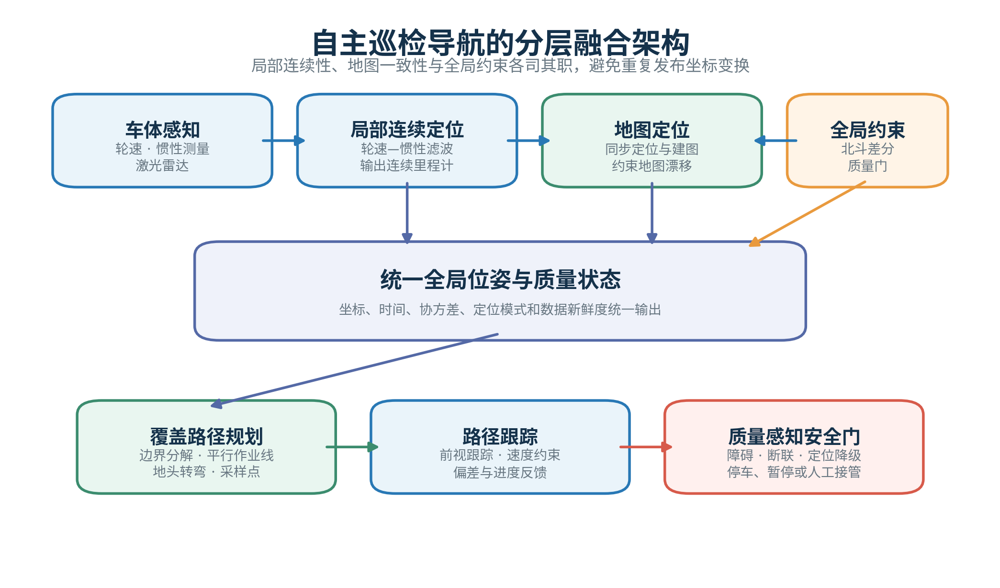
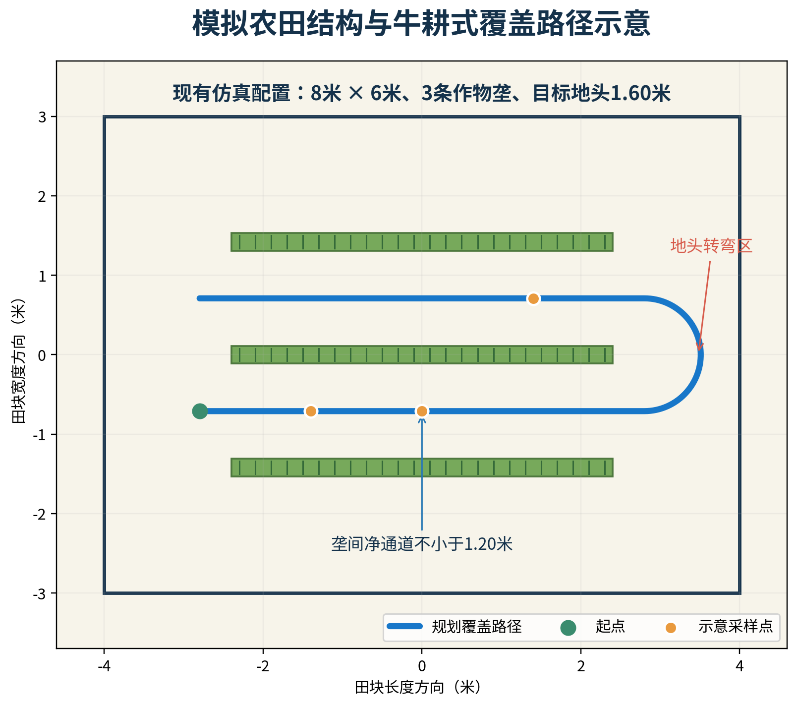

# 报告书三模块初稿（图表增强与学术化润色版）

> 项目：基于机器人与 DNA-PCR 技术的孢子病害识别关键技术研究  
> 版本：v3.0  
> 日期：2026-09-07  
> 适用范围：可直接拆分并入总报告的三个独立技术模块  
> 证据说明：已验证成果据实陈述；H-01～D-04 为已派发、预计提交前完成的任务，尚未返回的数值、图片、代码版本和视频均保留占位。文中图表分为“配置推导图”“阶段性数据图”和“现有界面截图”三类，均在图注中注明证据边界。

---

# 一、基于 SLAM、北斗 RTK 与覆盖路径规划的自主巡检导航方案

## 1.1 行业应用场景与设计目标

规模化种植场景要求移动平台在较少人工干预条件下重复进入指定田块，沿作物垄完成全覆盖巡检，并将每次采样与位置、时间建立可追溯关联。农田缺少规则道路与稳定人工标志，地面起伏、作物遮挡、重复垄形、强光和无线链路波动共同构成导航不确定性来源。轮速里程计存在累积漂移；二维激光 SLAM 难以直接建立地理坐标关联；普通 GNSS 则难以保障垄间巡检与重复采样所需的位置一致性。

针对这些问题，本项目设计“局部连续定位、全局绝对约束、田块覆盖规划和质量感知安全控制”四部分协同的导航方案。轮速与 IMU 提供连续运动估计，二维激光 SLAM 提供局部地图约束，北斗 RTK 提供可追溯的绝对位置，规划模块根据田块结构生成可执行路线，任务状态机负责巡航、转弯、到点停车、采样驻留和异常处理。该方案的目标不是简单叠加传感器，而是在统一坐标、统一任务文件和统一质量门下形成可实施、可替换、可验证的车辆导航系统。

定位误差不大于 0.5 m 是项目的目标指标。初稿不预设其已经达成，最终结果由 H-01 的硬件集成测试和 A-01 的融合算法交付据实回填。

*图 N-1 自主巡检导航的分层融合架构。该图依据当前 ROS 2 节点职责、坐标变换原则与目标 RTK 接入方案绘制，属于系统设计图，不替代 H-01/A-01 的实测融合结果。*

## 1.2 软硬件架构

车辆平台采用 WHEELTEC R550 PLUS 四轮底盘。C50C STM32 下位机负责电机闭环、编码器采集和底盘状态反馈，树莓派 5 负责 ROS 2 计算与上层任务。传感器配置包括轮速编码器、ICM20948 IMU、YDLIDAR X3 Pro 二维激光雷达和目标北斗 RTK 接收机。软件基于 ROS 2 Humble，按照驱动、定位、地图、规划、任务和安全六类功能划分节点。

驱动层把底盘反馈转换为 `/odom`、原始 IMU、电池和诊断等标准消息；局部定位层通过 `robot_localization` 融合轮速与 IMU；地图层采用 SLAM Toolbox 处理激光扫描和回环约束；全局定位层完成 RTK 状态解析、WGS84 到田块 ENU 的转换及质量门控；路线层解析版本化任务文件并执行平滑、重采样和 Pure Pursuit 跟踪；任务与安全层管理采样状态、暂停、返航、取消、传感器过期和障碍停车。

这种分层方式有三个工程优势：其一，雷达、RTK 或底盘可独立替换；其二，任一算法失效时能够明确定位责任层；其三，后续从原型扩展到不同地块和车型时，可保留上层路线与任务接口。

项目已有原型完成底盘、激光雷达、局部 EKF 和 SLAM Toolbox 的组合运行。融合里程计发布频率约为 20 Hz，激光扫描约为 11.3～11.45 Hz，为后续 RTK 接入和路径执行提供了可复用基础。

## 1.3 统一坐标与任务数据标准

导航系统采用 `field—map—odom—base_footprint—base_link—sensor_link` 分层坐标体系。`field` 是与地块对应的局部东—北—天坐标，便于保存边界、路线和采样点；`map` 是 SLAM 地图坐标；`odom` 提供局部连续运动坐标；`base_footprint` 和 `base_link` 表示车辆平面基准和车体中心；`laser_link`、`imu_link`、`gnss_link` 表示各传感器安装位置。

TF 变换采用唯一发布者原则。轮速—IMU EKF 只负责 `odom→base_footprint`；SLAM Toolbox 只负责 `map→odom`；机器人模型负责车体到各传感器的静态外参。RTK 融合不再启动第二个相互竞争的 `map→odom` 发布者，而是把合格的 RTK 坐标转换为 `field` 中的绝对观测，由全局对齐节点估计 `field→map`，或者由统一的全局状态估计器输出带质量标记的全局位姿。这样可以在保留局部轨迹连续性的同时，将 SLAM 地图稳定地放入田块地理坐标。

路线文件采用 `route_v1.json`，明确声明版本、`field` 坐标、local ENU 和米制单位。每个任务使用 `field_id`、`route_id` 和 `mission_id` 标识，每个采样点使用 `sample_id` 关联位姿、时间、检测和后续业务数据。统一数据标准解决了网页像素坐标、SLAM 地图坐标和车辆控制坐标容易混淆的问题，也是路线结果能够被不同终端和车辆重复使用的基础。

【图占位 N-2：field、map、odom、base_link 与各传感器坐标关系】  
【参考文献占位 N-1：ROS 2 TF2、robot_localization 与 ENU 坐标规范】

## 1.4 SLAM 与局部连续定位方法

局部连续定位由轮速—IMU EKF 提供。底盘编码器给出平面线速度和角速度，IMU 给出角速度与线加速度，扩展卡尔曼滤波器根据传感器协方差完成状态预测和观测更新，输出 `/odometry/filtered`。该位姿高频、连续，适合作为路径跟踪的直接输入。若融合位姿超过新鲜度门限，控制器可以短时回退到 `/odom`；若所有位姿均失效，则停止车辆，而不是使用过期数据继续运行。

SLAM Toolbox 以 `/scan`、局部里程计和时间同步信息为输入，通过扫描匹配建立二维占据栅格，并利用回环约束抑制长期地图变形。它的主要职责是维护 `map` 中的一致环境几何和修正 `map→odom`，而不是代替轮速—IMU EKF 产生全部高频运动状态。

项目已在 8 m × 6 m 的 canonical 模拟农田中完成实际 ROS 2/Gazebo 建图。场景包含三条模拟垄、1.20 m 净通道和 1.60 m 地头，完成九航点低速闭环、PGM/YAML 地图保存及 pose graph/data 保存。两次同配置地图的垄中心最大偏移为 0.050 m，低于 0.150 m 的仿真重复性门槛。2026-09-01 的临时单垄测试还完成了实车地图保存和 U 形掉头。这些成果证明建图、保存和局部导航链具备工程基础；H-02 将进一步提供模拟农田实物环境和标准地图文件。

*图 N-3 模拟农田结构与牛耕式覆盖路径。图中尺寸、三条模拟垄、净通道与地头参数源自现有 `simulated_farmland_8x6_v1` 配置；蓝色线路为根据该配置生成的规划示意，并非实车轨迹。*

【H-02 待回填：场景照片、尺寸、材料、地图文件名、分辨率、占据栅格和建图说明】

## 1.5 北斗 RTK 与 SLAM 分层融合方法

项目现有 ATGM336H 适配包已完成 NMEA GGA/GLL/VTG 解析，可发布 `/fix`、速度、航向、原始报文、诊断和可选 ENU 坐标。由于该设备属于普通单点 GNSS，系统只将其标记为 `single`，用于接口和降级链验证，不把它作为 RTK 固定解或亚米级精度证据。

目标方案采用支持北斗多频 RTK 的移动站、测量型天线及 CORS/NTRIP 差分服务；无可用 CORS 时，可部署自建基站。RTK 节点除输出经纬高外，还需提供 Single、Float、Fix、卫星数、协方差、差分龄期和数据时间戳。天线相位中心到 `base_link` 的杆臂外参经过测量后写入系统配置，避免车辆转弯时把天线偏置误当成车体位置变化。

融合过程分为三步。第一步，使用现场测定原点把 WGS84 坐标转换为 `field` 局部 ENU。第二步，对 RTK 观测执行质量门：Fix 且差分龄期、协方差和创新残差正常时作为强全局约束；Float 时降低权重；Single、过期或突跳时拒绝位置校正并发布降级状态。第三步，将通过质量门的 RTK 观测与同时刻 SLAM/局部位姿配对，估计 `field→map` 的平移和航向关系，并采用渐进更新抑制坐标瞬时跳变。

这套方法实现了职责互补：轮速—IMU EKF保证短时连续性，SLAM 维持局部地图一致性，RTK限制长期全局漂移并提供地理坐标。RTK 暂时受遮挡时，局部定位仍可维持车辆低速运行；当 RTK 降级时间超过阈值或 SLAM 质量同步下降时，任务状态机降低速度、暂停或请求人工处置。

A-01 将补充融合节点源码、真实输入输出、质量门参数和轨迹对比；H-01 将补充 RTK 硬件、差分方式和误差测试。目标误差是否达到 0.5 m，只依据最终独立参考轨迹计算的 RMSE、P95 和最大误差判断。

【图占位 N-4：轮速/IMU、SLAM、RTK 质量门和 field→map 对齐流程】  
【A-01 待回填：ROS 节点、算法流程、状态量、话题、协方差、质量门和轨迹对比】  
【H-01 待回填：RTK 型号、天线、CORS/基站、Fix 比例、真值方法、RMSE、P95、最大误差】

## 1.6 牛耕式覆盖路径规划与车辆跟踪

路径规划以田块边界、主垄方向、垄间距、地头宽度、采样密度和车辆最小转弯半径为输入。系统先检查多边形是否闭合、是否自交、尺度是否有效，再沿主作业方向生成等距平行线，与田块边界求交得到有效作业段。相邻作业段按方向交替排列，形成牛耕式覆盖顺序；地头连接采用满足最小转弯半径的平滑 U 形过渡。采样点既可按均匀覆盖配置，也可在后续应用中依据风险等级增加局部密度。

规划结果导出前执行边界、序号、连续性、曲率、速度、采样身份和起终点校验。每个航点包含米制坐标、航向、类型、轮次、速度上限、到达容差和可选 `sample_id`。车辆加载路线后，将 `field` 航点转换到 `map`，再进行 0.1 m 等弧长重采样和路径平滑，以降低尖锐折线对底盘的冲击。

当前低速跟踪采用 Pure Pursuit。控制器从路径上选择前视点，根据车体坐标中的横向偏差求取曲率，并在最大线速度 0.12 m/s、最大角速度 0.30 rad/s 和前视距离 0.5 m 的约束下生成 `/cmd_vel`。参数均可根据地块通道、负载和定位质量调整，后续还可扩展为基于定位协方差的自适应速度控制。

项目已有路线 schema、坐标转换、平滑、Pure Pursuit 和采样状态机代码，并记录 1 m 直线、3 m 直线、方形回环、双垄往复、多点采样路线和静态障碍停车六类小尺度实车试验。D-03 将补充牛耕式转弯、巡航和全覆盖视频。

【图占位 N-5：边界分解、平行作业线、U 形转弯、采样点和车辆轨迹】  
【D-03 待回填：MP4 文件、路线参数、巡航速度、转弯关键帧、覆盖结果和运行说明】

## 1.7 任务状态机与质量感知安全控制

自主巡检任务按照“载入—导航—到达—稳定—请求采样—采样—完成—继续”推进，并支持暂停、恢复、返航、取消、停止和故障。采样器未接入时，系统通过 2 s 模拟驻留验证状态顺序；接入真实采样器后，只需把采样请求和完成事件替换为实际设备接口，路径跟踪逻辑保持不变。

车端安全判定独立于浏览器运行，持续检查路线合法性、位姿和激光数据新鲜度、未知任务状态以及前方障碍。当前障碍判断使用可配置前向扇区，现有默认值为 ±90°、距离阈值为 0.5 m；D-04 视频重点验证前方 ±45° 核心危险区内的刹停或绕障，终稿以演示时实际配置为准。发生障碍、数据过期或状态异常时，车辆输出零速度并发布原因，条件恢复后由状态机决定继续还是等待人工确认。

安全体系采用三层结构：车辆任务节点负责软件安全门；底盘驱动使用速度限制和 0.30 s 指令超时；现场保留人工物理急停和断电。历史严格复测发现固件失联停车约为 1.309～1.409 s，超过项目设置的 1.2 s 门槛。该结果不否定总体设计，而是说明工程化验证前应继续缩短固件响应，并保留上层看门狗和物理急停冗余。

【图占位 N-6：任务状态机与数据过期、障碍、断联三类安全分支】  
【D-04 待回填：MP4、扇区参数、阈值、刹停距离、绕障路径和现场安全记录】

## 1.8 工程实施路线、创新性与可行性

方案可按六步实施：首先安装并标定底盘、雷达、IMU 和 RTK 外参；其次验证轮速—IMU EKF 与 TF 链；第三完成实物模拟农田建图和 `field/map` 对齐；第四接入 RTK 差分并完成质量门；第五导入标准路线，验证直线、转弯、采样和全覆盖；第六使用独立真值计算定位与跟踪误差，并完成障碍、断联和降级测试。RTK 链路可在 CORS 与自建基站之间选择，以适应不同地区的差分服务条件、网络质量与部署资源。

本模块包含三项核心创新。第一，针对 RTK 和 SLAM 各自的局限，采用局部连续估计与全局坐标对齐分层设计，既避免 TF 冲突，又能在卫星信号退化时维持局部运动。第二，以版本化米制路线包统一规划和执行，把坐标、车辆约束和采样身份纳入同一任务。第三，将定位质量、消息新鲜度和障碍信息直接连接到任务状态机，使降级行为可解释、可记录、可复现。

现有 ROS 2 基础栈、仿真建图、小尺度实车路线和单垄场地结果已经验证了主要接口；H-01、H-02、A-01、D-03 和 D-04 将补齐 RTK、实物场景、融合算法和演示材料。由此，方案具备从原型继续推进到真实田间验证的现实基础。面向规模化应用，还应补充长期户外稳定性、不同作物冠层适应性、独立真值重复试验、真实采样器联动和安全认证。

【表占位 N-1：目标指标、现有基础、提交前成果和工程化验证】  
【参考文献占位 N-2：SLAM Toolbox、Pure Pursuit、RTK/NTRIP 和多传感器融合资料】

---

# 二、统一总控制台与电脑/手机双端控制方案

## 2.1 技术产品定位与建设目标

孢子病害巡检涉及地块、机器人、环境、采样、PCR、病害、预测和处置等多源异构数据。若分别使用地图软件、桌面分析程序和设备调试工具，易造成任务编号、采样位置与检测结果的语义断裂。系统据此面向两类典型使用情境：规划与研判人员在电脑端完成地图、路线、统计和报告，现场作业人员通过手机查看设备状态、接收告警并执行受限任务操作。

本项目据此设计统一总控制台。系统以一套响应式 Web 业务核心承载七类功能，再封装为 Windows/Linux 桌面应用和 Android 移动应用。两端共享数据契约和业务算法，但依据屏幕条件、使用职责与安全边界呈现不同操作重点。该架构减少多端重复实现导致的功能漂移，并为边缘部署、云端协同和跨地块数据治理保留扩展空间。

【图占位 C-1：规划研判、现场作业与安全保障角色在电脑端和手机端的使用场景】

## 2.2 一核多端的软件架构

控制台由表现与封装、业务、数据契约、设备接入和通用服务五个层次构成。表现与封装层采用 Next.js、React 和响应式 CSS，实现同一代码在不同屏幕下重排，并由 D-01 最终选定的桌面和 Android 容器生成安装包。业务层包含路径规划、环境感知、PCR 分析、病害识别、趋势预警、监管告警和机器人监控七个页签。数据契约层统一路线、任务、遥测、样本、预测、告警和本地会话。设备接入层通过 rosbridge 接收 ROS 2 数据，并支持 Mock 和 Replay。通用服务层为后续账户、数据库、文件存储和审计能力提供可扩展接口。

七个页签并非简单并排的页面。每个页签都具有明确输入和输出：路径规划页生成标准路线任务；环境页形成传感快照和异常；PCR 页形成质量受控的定量结果；病害页保存识别与人工确认；趋势页输出 3/5/7 天风险；监管页形成告警处置记录；机器人页显示实时位置、轨迹、雷达、电池、诊断和任务状态。统一的 ID 与 schema 使这些功能既可独立运行，也可在行业信息化系统中按需组合。

*图 C-2 一套业务核心支撑电脑端与手机端。该图根据当前前端的七类业务页签、Mock/Replay/rosbridge 数据来源及车端安全边界绘制，属于软件架构图。*

## 2.3 电脑端与移动端交互设计

电脑端承担信息密度较高的工作，包括地块建档、底图或 SLAM 地图导入、精细边界编辑、路线参数设置、批量 PCR 数据处理、多模型对比、热力图分析和报告导出。宽屏布局同时展示参数面板、地图和统计信息，便于规划研判人员完成任务准备与综合分析。

移动端面向现场快速操作，优先显示机器人连接、任务进度、当前航点、RTK 状态、电池、告警和关键风险摘要。页签采用横向滚动，表单和状态卡在窄屏下重排为两列或单列。暂停、返航、取消和告警确认采用大尺寸按钮与二次确认，降低户外操作误触。直接线速度和角速度控制不作为常规手机功能，仅在授权维护模式下开放。

当前 Web 已实现 900 px、680 px 和 520 px 三档响应式规则。D-01 将在同一业务核心基础上完成桌面和 Android 封装。由于具体封装技术尚待成员交付，初稿不预设 Electron、Tauri、Capacitor 或其他工具；终稿根据实际构建方案记录版本、包名和系统要求。

*图 C-3 控制台电脑端路径规划界面截图。来源：2026-09-07 本地启动的当前 Web 控制台；该截图证明现有界面与路径规划功能入口，不作为 Windows/Linux 安装包已完成的证据。*

*图 C-4 Android 端阶段性展示原型截图。来源：项目内 `multiplatform-showcase/docs/evidence`；该截图用于呈现移动端信息层级与告警展示，不替代 D-01 最终 APK 的安装与真机验收记录。*

【D-01 待回填：封装技术、版本号、安装包、APK、目标系统、安装步骤和真机截图】

## 2.4 统一数据契约与多源数据管理

系统通过版本化数据契约避免不同终端、不同模块和不同运行阶段出现语义分裂。路线采用 `route_v1.json`；任务记录 `mission_id`、状态、当前航点、进度和预计时间；遥测包含位姿、雷达、电池、诊断、RTK 和采样器状态；样本通过 `sample_id` 关联位置、时间、PCR 和风险。未知版本、未知坐标、错误单位和非法状态在进入业务层前被拒绝。

控制台把数据来源明确分为 Mock、Replay 和 rosbridge。Mock 用固定种子模拟正常巡检和断联、低电量、位姿跳变、RTK 降级、障碍、采样失败等情况；Replay 复现带版本的历史任务；rosbridge 接收真实车辆遥测。所有导出数据保留来源标签和时间戳，使使用者能够区分演示、回放和实际运行结果。

当前本地会话仓库能够保存和恢复工作区，支持旧版本迁移，并拒绝密码、令牌等敏感字段。该机制适合离线原型和单机演示。规模化部署阶段再增加 PostgreSQL/PostGIS、文件存储和审计服务，前端仍使用相同的数据模型，不需要推翻已有业务代码。

## 2.5 ROS 实时接入与弱网降级

车辆侧通过 rosbridge WebSocket 向控制台提供 `/odometry/filtered`、`/odom`、`/scan`、`/battery_state`、`/diagnostics`、`/mission/status` 和可选 `/gps/status`。适配层优先使用融合里程计，并将车辆原生状态转换为统一任务状态。每类消息都设置新鲜度门限；数据过期、断联或格式错误时，界面显示 stale 或 unavailable，不使用旧数值维持“看似正常”的状态。

双端应用不承担底盘实时闭环。浏览器负责用户交互、任务管理和状态展示，底盘看门狗、障碍停车和任务状态机保留在车端，即使手机退出、电脑休眠或无线网络中断，车辆仍能够按本地规则停车。弱网场景下，控制台保留最近一次地图和任务摘要，待网络恢复后按 ID 和时间戳同步事件；涉及运动的新操作在连接和状态重新确认前保持禁用。

项目已完成基础 rosbridge 静止实机数据接收，并实现融合位姿优先、雷达、电池、诊断和任务状态适配。这些成果证明实时数据链可行，但不将其扩大为完整远程无人控制验收。

【图占位 C-5：ROS 2 话题、rosbridge、数据适配、电脑端和手机端的数据链与断联分支】

## 2.6 当前安全机制与角色权限设计

当前原型已经具备四项基础安全机制：页面不自动连接机器人；运动控制默认锁定；解锁前要求用户确认车辆状态、区域清空和急停人员就位；断开连接后自动重新锁定。Mock 和 Replay 模式只改变本地状态，不发布真实运动指令。这些机制降低开发和演示过程中误发命令的风险。

角色权限体系属于目标设计。系统可设置观察员、农技人员、任务管理员、现场安全员和系统管理员。观察员只查看状态；农技人员确认检测和处置；任务管理员创建路线并管理任务；现场安全员负责运动授权和物理急停；系统管理员维护设备、账户和审计。高风险操作采用身份认证、角色授权、二次确认、短时令牌和事件记录。手机端默认不开放连续速度控制，任务暂停、返航和取消也需要明确的车辆状态和操作确认。

软件停车不能替代物理急停。发生浏览器或网络故障时，车端安全门仍应独立生效；发生底层失控时，则由现场急停和断电处理。通过将任务管理便利性与运动安全责任分离，双端控制方案支持远程状态查看与受限任务操作，同时不将关键安全建立在移动网络之上。

【图占位 C-6：当前连接锁、角色权限、二次确认、车端安全门与物理急停的分层关系】

## 2.7 多端封装、部署与验收路线

多端交付按四步实施。第一步，冻结同一 Web 核心的功能和数据版本；第二步，完成桌面和 Android 封装、图标、版本、安装与自动更新配置；第三步，在 Windows、Linux 和 Android 真机上完成安装、启动、页面适配和文件导入导出；第四步，让电脑和手机连接同一 Mock/Replay 或 rosbridge 数据源，对比任务、位姿、电池、告警和时间戳的一致性。

最低验收应覆盖：桌面宽屏和 390×844、412×915 两类移动视口；七页签可访问；关键按钮不遮挡；地图和表格可滚动；安装包和 APK 可独立启动；断联后两端均显示异常；未授权状态不能发布运动命令。若报告提交前尚未完成双端实车运动验证，可用静态 rosbridge 验证遥测一致性，并把运动控制保留为受限工程化功能，不影响多端平台总体方案成立。

【表占位 C-1：电脑端、手机端功能与权限矩阵】  
【表占位 C-2：Windows、Linux、Android 安装和核心功能验收】

## 2.8 创新性、行业价值与可行性

本模块第一项创新是“一核多端”：电脑端与手机端共享业务核心、算法和数据契约，避免传统双端项目分别开发造成的功能漂移。第二项创新是把地图、任务、车辆、样本、PCR、预测和告警纳入可追溯的数据模型，使平台不仅展示信息，还能支撑业务闭环和责任追踪。第三项创新是来源感知和弱网安全设计，系统明确区分模拟、回放和实测数据，并把实时安全留在车端。

面向农田移动巡检与病害监测应用，该方案能够降低多端软件维护与操作培训成本，支持跨地块任务查看，也允许现场人员通过手机快速处理告警；系统既可在局域网和边缘计算环境中运行，也可扩展为集中式服务。当前七页签、响应式布局、路线导出、数据契约、Mock/Replay、rosbridge 适配和构建测试提供了实现基础，D-01 将补齐可安装的桌面端和 Android 端成果。

比赛阶段重点展示统一架构、多端运行、数据一致性和安全边界。面向规模化部署，仍需完善账户与审计、HTTPS、后端数据库、设备证书、远程升级、高清视频和长期并发运行测试。

【参考文献占位 C-1：rosbridge/WebSocket、响应式设计、机器人远程操作安全与权限管理资料】

---

# 三、PCR 观测驱动的孢子扩散预测预警方案

## 3.1 行业问题与算法定位

病害出现肉眼症状时往往已错过最佳干预窗口。空气孢子与 PCR 能够提供更早的病原信号，但离散采样点本身不能直接说明孢子将向何处传播、哪些区域应优先复检，以及环境条件是否支持侵染。行业应用所需的并非单一浓度数值，而是具有位置、时间、置信度与处置意义的风险分布。

传统高斯烟羽模型计算快速、易解释，适合连续单点源和稳定风场；真实农田却常出现风向转折、间歇释放、冠层衰减、紫外失活和降雨清除。为此，本项目提出“粗测—PCR 融合、贝叶斯源项反演、动态平流扩散、孢子命运和侵染窗口”五层预测方案。算法的定位不是在所有条件下取代高斯模型，而是在非稳态农田环境中提供更合理的空间表达，并把预测结果转化为复检和防控优先级。

*图 A-1 观测驱动的孢子扩散预测预警流程。该图依据当前算法设计与现有预测引擎的输入输出边界绘制；“疑似源”“侵染风险”均为模型推断结果，不构成病原来源或发病的直接确证。*

## 3.2 输入、输出与质量控制

算法输入包括田块边界、采样坐标、`sample_id`、粗测值、PCR Ct 与换算浓度、样本质量、风速和风向时间序列、温度、湿度、光照、降雨、LAI、株高、病情指数及目标病害。输出包括疑似源位置与相对源强、后验不确定度、3/5/7 天浓度网格、峰值、P90、均值、热点面积、侵染概率、潜育期提示、风险等级和建议。

数据进入模型前执行三类控制。第一，检查坐标、时间和单位是否完整，田块外点和非法数值直接拒绝；第二，根据 PCR 质量标记决定使用方式，pending 和 invalid 不参与反演，doubtful 观测增大方差；第三，记录数据来源和模型版本，保证模拟、回放和实测结果可区分。

PCR 的真实空气等效浓度还取决于采样体积、洗脱体积、稀释倍数、捕获效率和提取回收率。在单位链完成标定前，报告使用“相对浓度”或“合成浓度”；算法结构不依赖具体单位，待标定后可替换尺度参数而不重写计算流程。

## 3.3 高斯烟羽基线及其适用范围

高斯烟羽把稳定风场中的连续点源传播表示为横向和垂向高斯分布，其基本形式为：

\[
C(x,y,z)=\frac{Q}{2\pi u\sigma_y\sigma_z}
\exp\left(-\frac{y^2}{2\sigma_y^2}\right)
\left[\exp\left(-\frac{(z-H)^2}{2\sigma_z^2}\right)+
\exp\left(-\frac{(z+H)^2}{2\sigma_z^2}\right)\right]
\]

式中，`Q` 为源强，`u` 为平均风速，`σ_y` 和 `σ_z` 为稳定度相关扩散尺度，`H` 为有效源高。项目基线保留地面镜像和沉降衰减，使模型能够在较低计算成本下给出稳态传播方向和浓度梯度。

该模型是本项目的重要基线，而不是被刻意弱化的对手。在风向和释放稳定时，它应当具有竞争力；其不足主要发生在风向转折、逐时天气变化、多个热点和降雨事件中。因此，本项目一方面用高斯烟羽承担稳态对照和粒子滤波快速前向计算，另一方面用动态数值模型处理它无法表达的时间记忆和命运过程。

*图 A-2 高斯烟羽基线与动态方案的适用性对比。该表以模型假设和可表达过程为比较维度，强调两类模型的场景互补关系，而非将基线模型设为弱对照。*

【参考文献占位 A-1：Gaussian plume、Pasquill 稳定度和农业孢子传播资料】

## 3.4 粗测—PCR 融合空间基准场

粗测能够以较低成本覆盖大量位置，但精度和特异性有限；PCR 具有更高特异性，却难以高密度布点。本方案先对粗测结果进行空间插值，形成连续趋势场，再使用 PCR 观测做稳健尺度标定和局部残差校正。质量可靠的 PCR 点获得较高权重，存疑点降低权重，缺失点不参与计算。

融合结果保留粗测的空间覆盖，同时利用 PCR 纠正关键区域的幅值和判定。该场既可以作为动态模型的初始条件，也可以提供源项反演观测。田块外网格始终屏蔽；当 PCR 点数量不足或分布近似共线时，算法降低置信度并回退到不含显式源项的融合预测。

这种设计的工程价值在于降低全部点位进行高成本 PCR 的需求。系统可先通过机器人完成广覆盖粗筛，再对少量高风险点开展 PCR，最终形成更具空间连续性的风险基准。

## 3.5 贝叶斯源项反演

疑似源状态记为 `θ=[x_s,y_s,log10Q]`。粒子在田块内部和合理源强范围内采样，高斯烟羽作为快速前向模型计算各粒子在 PCR 点处的预测浓度。算法在 `log10` 空间构造观测似然并归一化权重，随后计算源位置、源强、协方差、不确定椭圆和有效粒子数。

对数空间有利于处理跨数量级浓度，也更符合 PCR 倍数误差特征。当前默认观测噪声尺度约为 0.3 个数量级，doubtful 样本使用更大的方差。有效观测少于两个时，单点无法同时约束源方向、距离和强度，算法不强行给出源位置；两至三个点时标记低置信度；点位增加且空间分布改善后，再输出较集中的后验。

该方法把“已检测到孢子”进一步转化为“疑似源可能位于何处以及该判断有多大不确定性”。随着新一轮采样加入，后验可以重新计算，指导有限复检资源投向信息增益更高的位置。报告始终使用“疑似源估计”，不把反演结果表述为病原源的直接生物学确证。

【图占位 A-3：粒子权重更新、疑似源位置和不确定椭圆】

## 3.6 动态平流—扩散—命运模型

A-02 的目标重构方案采用逐时二维 Eulerian 网格，其连续形式概括为：

\[
\frac{\partial C}{\partial t}+\mathbf{u}\cdot\nabla C
=\nabla\cdot(K\nabla C)+S-
(\lambda_{uv}+\lambda_{dep}+\lambda_{rain})C+R
\]

其中，`C` 为孢子浓度，`u` 为近冠层有效风矢量，`K` 为湍流扩散系数，`S` 为源播种，`λ_uv`、`λ_dep` 和 `λ_rain` 分别表示紫外失活、沉降与雨洗损失，`R` 表示再释放。该方程是报告采用的完整设计模型；最终离散公式、时间步长和参数以 A-02 交付代码为准。

每个时间步按以下顺序计算：读取并插值逐时风速、风向、温湿度、光照和降雨；根据株高与 LAI 修正近冠层风场；完成质量守恒的平流输送；根据稳定度和冠层条件进行邻域扩散；计算紫外、沉降与雨洗损失；叠加初始感染区或病斑的再释放；检查非负性和田块边界；在 72、120、168 h 保存预测切片。

水平输送只由有效风矢量和无量纲冠层折减决定，沉降速度只进入垂向沉积或损失项，避免不同物理量混用。阵雨按实际发生时段施加，雨停后不重复扣除整段降雨。Web 端采用适合交互的粗网格，离线 Python 管线用于批量场景和高分辨率对照；二者使用同一输入输出 schema，并通过固定场景快照核对峰值、均值和热点范围。

【A-02 待回填：最终离散算法、逐时天气接口、参数表、TypeScript/Python 一致性、运行效率和精度】  
【参考文献占位 A-2：平流扩散、沉降、紫外失活、雨洗、再悬浮和冠层风场资料】

## 3.7 侵染窗口与 3/5/7 天预警

浓度场反映孢子暴露，发病还取决于病原、宿主和环境是否共同满足侵染条件。本方案为八种目标病害维护适宜温度、湿度、叶面湿润时长和潜育期参数。当预报期内累计满足侵染窗口时，再根据孢子剂量计算侵染概率：

\[
P_{inf}=I_{window}\left(1-\exp(-D/D_0)\right)
\]

`I_window` 表示侵染窗口，`D` 为累计剂量，`D_0` 为病害相关尺度参数。当前参数表用于原型和情景分析，田间部署时需结合本地品种、病原和检测单位标定。系统在 3、5、7 天节点输出浓度、侵染概率、热点范围和置信度，并根据风险等级建议增加下风向采样、缩短复检周期或开展重点防控。

如果没有未来时刻的真实发病标签，该输出应称为“风险预测和预警建议”，不能直接报告真实预警准确率。实际应用中还应保留农技人员确认环节，将模型作为资源配置和复检决策工具，而不是替代最终诊断。

## 3.8 对比实验、阶段结果与证据回填

模型评估设置四组：G0 为传统稳态高斯烟羽，E0 为不含源项同化的动态模型，E1 为源同化加恒定风，E2 为源同化加逐时天气的完整方案。训练点只用于尺度标定和源估计，独立留出点用于 RMSE、MAE、相关系数、热点 IoU、峰值位置误差和源位置误差。正式实验还应报告多随机种子的均值和范围，并对风速、扩散和雨洗参数进行敏感性分析。

当前可引用的 v1 结果来自独立动态烟团生成器和粗网格 Eulerian 离线代理，不等同于 A-02 最终 TypeScript 运行时算法。每个场景包含 20 个校准点和 60 个留出点。稳定风场中，高斯烟羽的 `log10 RMSE` 为 0.437，优于动态代理的 0.720；风向转折时，动态代理为 1.476，高斯烟羽为 3.497；风向变化并伴随阵雨时，两者分别为 1.267 和 3.200。动态场景中误差分别降低约 57.8% 和 60.4%，而稳态场景保留高斯模型优势，说明实验没有预先把所有场景设计为支持新方法。

上述数据只能证明合成场景中的方法潜力。D-02 将根据 A-02 最终版本补充统一色标热力图、指标表和原始数据。终稿应把 v1 结果、最终软件算法结果和未来田间验证分成三个证据层级，避免跨层引用。

【图占位 A-4：稳态、风向转折、阵雨场景的参考场与两种模型结果】  

*图 A-5 合成留出点上的阶段性模型对比。数据直接读取项目内 `scenario_metrics.csv`：每场景20个校准点、60个独立留出点。动态方法指当前离线代理，不等同于 A-02 重构后的最终运行时算法，且不代表田间预测准确率。*

【D-02 待回填：最终场景配置、CSV/JSON、图表、脚本、随机种子和结论】

## 3.9 工程实施路线、创新性与可行性

算法落地分为五步。第一，冻结 PCR 单位、天气数据和病害参数；第二，用历史或合成数据完成源估计和动态模型离线验证；第三，将最终 TypeScript 算法接入控制台并进行固定场景一致性检查；第四，用半实物示踪或多轮现场采样形成时间外验证；第五，按地区、作物和病害进行参数本地化，并建立模型版本、置信度和人工复核机制。

本模块的第一项创新是以 PCR 观测反演疑似源和不确定性，使稀疏高可信检测能够主动修正模型；第二项创新是用逐时风场及紫外、沉降、雨洗和再释放过程处理传统稳态烟羽难以表达的非稳态传播；第三项创新是把浓度、侵染窗口、剂量响应和潜育期结合，输出面向复检和防控的空间—时间风险。

方案已经具备 TypeScript 预测引擎、粒子滤波、侵染窗口、高斯 A/B 和 Python 实验管线，当前引擎 16 项测试通过，第一轮合成结果也给出了公平的稳态和动态对照。A-02 和 D-02 将继续补齐最终算法、效率、精度和报告图表。该方案能够在没有高密度 PCR 的条件下组织有限检测资源，并以风险图和置信度支持更早、更有针对性的复检。真实 3～7 天提前量和田间准确率仍需跨时间真实观测验证；这属于模型标定与持续评价阶段的必要工作，不构成对总体技术路线的否定。

【表占位 A-1：高斯基线与重构方法的输入、假设、动态过程、输出和适用场景】  
【表占位 A-2：当前软件基础、A-02/D-02 提交前成果和后续田间验证】  
【参考文献占位 A-3：粒子滤波、病害侵染窗口、剂量响应和预警评价资料】

---

# 四、初稿使用说明

以上三部分均可独立进入总报告。导航章节以 `route_v1.json` 和全局位姿作为外部接口；控制台章节以版本化任务、遥测和业务数据作为接口；扩散章节以带坐标、时间和质量标记的观测作为接口。是否在总报告中把三者串联为完整系统流程，由后续整合阶段决定，本初稿不以强制技术链为前提。

H-01、H-02、A-01、A-02、D-01、D-02、D-03 和 D-04 均为已派发任务。本文已经按其预计完成后的逻辑写出完整方案，但所有尚未取得的实测数值、代码版本、安装包、图片和视频均保留任务编号。成果返回后，应先核对原始证据，再把相应占位替换为实际结果；未按时返回的内容则保留为实施方案和验证方法，不补写推测数据。
